<!DOCTYPE html>
<!-- saved from url=(0055)https://cryptodeeptech.ru/pixnapping-attack-on-android/ -->
<html lang="en-US">

<head><meta http-equiv="Content-Type" content="text/html; charset=UTF-8">
	
	<meta name="viewport" content="width=device-width, initial-scale=1">
	<link rel="profile" href="https://gmpg.org/xfn/11">

	<meta name="robots" content="index, follow, max-image-preview:large, max-snippet:-1, max-video-preview:-1">
	
	
	<!-- This site is optimized with the Yoast SEO plugin v26.2 - https://yoast.com/wordpress/plugins/seo/ -->
	<title>Pixnapping Attack: Compromising private keys and seed phrases through vulnerability CVE-2025-48561 represents a new critical threat to the Bitcoin network and Android infrastructure - «CRYPTO DEEP TECH»</title>
	<meta name="description" content="This article describes modern methods for extracting and compromising private keys from cryptocurrency wallets, including Bitcoin, Ethereum, and other digital assets. The study examines a new Android vulnerability — Pixnapping (CVE-2025-48561), which allows attackers to reconstruct screen content pixel by pixel and extract private keys, seed phrases, and 2FA codes without user permissions. It details the attack principles involving the GPU.zip side-channel, the use of Android Intents and the window blur API, and demonstrates how hardware and software side channels can turn a smartphone into a potential source of cryptographic data leakage. The article emphasizes the need for comprehensive protection measures and a reassessment of current approaches to mobile crypto wallet security." class="yoast-seo-meta-tag">
	<link rel="canonical" href="https://cryptodeeptech.ru/pixnapping-attack-on-android/" class="yoast-seo-meta-tag">
	<meta property="og:locale" content="en_US" class="yoast-seo-meta-tag">
	<meta property="og:type" content="article" class="yoast-seo-meta-tag">
	<meta property="og:title" content="Pixnapping Attack: Compromising private keys and seed phrases through vulnerability CVE-2025-48561 represents a new critical threat to the Bitcoin network and Android infrastructure - «CRYPTO DEEP TECH»" class="yoast-seo-meta-tag">
	<meta property="og:description" content="This article describes modern methods for extracting and compromising private keys from cryptocurrency wallets, including Bitcoin, Ethereum, and other digital assets. The study examines a new Android vulnerability — Pixnapping (CVE-2025-48561), which allows attackers to reconstruct screen content pixel by pixel and extract private keys, seed phrases, and 2FA codes without user permissions. It details the attack principles involving the GPU.zip side-channel, the use of Android Intents and the window blur API, and demonstrates how hardware and software side channels can turn a smartphone into a potential source of cryptographic data leakage. The article emphasizes the need for comprehensive protection measures and a reassessment of current approaches to mobile crypto wallet security." class="yoast-seo-meta-tag">
	<meta property="og:url" content="https://cryptodeeptech.ru/pixnapping-attack-on-android/" class="yoast-seo-meta-tag">
	<meta property="og:site_name" content="«CRYPTO DEEP TECH»" class="yoast-seo-meta-tag">
	<meta property="article:published_time" content="2025-10-26T18:51:54+00:00" class="yoast-seo-meta-tag">
	<meta property="article:modified_time" content="2025-10-27T10:24:41+00:00" class="yoast-seo-meta-tag">
	<meta property="og:image" content="https://cryptodeeptech.ru/wp-content/uploads/2025/10/066.png" class="yoast-seo-meta-tag">
	<meta property="og:image:width" content="1280" class="yoast-seo-meta-tag">
	<meta property="og:image:height" content="720" class="yoast-seo-meta-tag">
	<meta property="og:image:type" content="image/png" class="yoast-seo-meta-tag">
	<meta name="author" content="Crypto Deep Tech" class="yoast-seo-meta-tag">
	<meta name="twitter:card" content="summary_large_image" class="yoast-seo-meta-tag">
	<meta name="twitter:label1" content="Written by" class="yoast-seo-meta-tag">
	<meta name="twitter:data1" content="Crypto Deep Tech" class="yoast-seo-meta-tag">
	<meta name="twitter:label2" content="Est. reading time" class="yoast-seo-meta-tag">
	<meta name="twitter:data2" content="40 minutes" class="yoast-seo-meta-tag">
	
	<!-- / Yoast SEO plugin. -->

<link rel="dns-prefetch" href="https://fonts.googleapis.com/">
<link rel="alternate" type="application/rss+xml" title="«CRYPTO DEEP TECH» » Feed" href="https://cryptodeeptech.ru/feed/">
<link rel="alternate" type="application/rss+xml" title="«CRYPTO DEEP TECH» » Comments Feed" href="https://cryptodeeptech.ru/comments/feed/">
<link rel="stylesheet" id="itng-block-style-css" href="./Pixnapping-Attack-on-Android_files/block-styles.css" media="all">
<link rel="stylesheet" id="dashicons-css" href="./Pixnapping-Attack-on-Android_files/dashicons.min.css" media="all">
<link rel="stylesheet" id="admin-bar-css" href="./Pixnapping-Attack-on-Android_files/admin-bar.min.css" media="all">

<link rel="stylesheet" id="wp-block-library-css" href="./Pixnapping-Attack-on-Android_files/style.min.css" media="all">

<link rel="stylesheet" id="wbcr-clearfy-adminbar-styles-css" href="./Pixnapping-Attack-on-Android_files/admin-bar.css" media="all">
<link rel="stylesheet" id="wp-date-remover-css" href="./Pixnapping-Attack-on-Android_files/wp-date-remover-public.css" media="all">
<link rel="stylesheet" id="itng-fonts-css" href="./Pixnapping-Attack-on-Android_files/css" media="all">
<link rel="stylesheet" id="itng-style-css" href="./Pixnapping-Attack-on-Android_files/style.css" media="all">
<link rel="stylesheet" id="itng-main-style-css" href="./Pixnapping-Attack-on-Android_files/default.css" media="all">

<link rel="stylesheet" id="bootstrap-css" href="./Pixnapping-Attack-on-Android_files/bootstrap.css" media="all">
<link rel="stylesheet" id="owl-css" href="./Pixnapping-Attack-on-Android_files/owl.carousel.css" media="all">
<link rel="stylesheet" id="mag-popup-css" href="./Pixnapping-Attack-on-Android_files/magnific-popup.css" media="all">
<link rel="stylesheet" id="font-awesome-css" href="./Pixnapping-Attack-on-Android_files/font-awesome.css" media="all">
<link rel="stylesheet" id="wp-fastest-cache-toolbar-css" href="./Pixnapping-Attack-on-Android_files/toolbar.css" media="all">
<link rel="stylesheet" id="yoast-seo-adminbar-css" href="./Pixnapping-Attack-on-Android_files/adminbar-2620.css" media="all">
<link rel="stylesheet" id="autoptimize-toolbar-css" href="./Pixnapping-Attack-on-Android_files/toolbar.min.css" media="all">
<link rel="stylesheet" id="wp-statistics-front-css" href="./Pixnapping-Attack-on-Android_files/frontend.min.css" media="all">
		
		

<link rel="https://api.w.org/" href="https://cryptodeeptech.ru/wp-json/"><link rel="alternate" title="JSON" type="application/json" href="https://cryptodeeptech.ru/wp-json/wp/v2/posts/3522"><link rel="alternate" title="oEmbed (JSON)" type="application/json+oembed" href="https://cryptodeeptech.ru/wp-json/oembed/1.0/embed?url=https%3A%2F%2Fcryptodeeptech.ru%2Fpixnapping-attack-on-android%2F">
<link rel="alternate" title="oEmbed (XML)" type="text/xml+oembed" href="https://cryptodeeptech.ru/wp-json/oembed/1.0/embed?url=https%3A%2F%2Fcryptodeeptech.ru%2Fpixnapping-attack-on-android%2F&amp;format=xml">
<!-- Analytics by WP Statistics - https://wp-statistics.com -->
		
		
	<link rel="icon" href="https://cryptodeeptech.ru/wp-content/uploads/2022/07/cropped-favicon7-32x32.png" sizes="32x32">
<link rel="icon" href="https://cryptodeeptech.ru/wp-content/uploads/2022/07/cropped-favicon7-192x192.png" sizes="192x192">
<link rel="apple-touch-icon" href="https://cryptodeeptech.ru/wp-content/uploads/2022/07/cropped-favicon7-180x180.png">
<meta name="msapplication-TileImage" content="https://cryptodeeptech.ru/wp-content/uploads/2022/07/cropped-favicon7-270x270.png">
</head>

<body data-rsssl="1" class="wp-singular post-template-default single single-post postid-3522 single-format-standard logged-in admin-bar custom-background wp-custom-logo wp-theme-it-news-grid no-sidebar customize-support" data-burst_id="3522" data-burst_type="post">

		

						

				<ul role="menu" id="wp-admin-bar-root-default" class="ab-top-menu"><li role="group" id="wp-admin-bar-wp-logo" class="menupop"><a class="ab-item" role="menuitem" aria-expanded="false" href="https://cryptodeeptech.ru/wp-admin/about.php">About WordPress</a>
<ul role="menu" aria-label="About WordPress" id="wp-admin-bar-wp-logo-default" class="ab-submenu"><li role="group" id="wp-admin-bar-about"><a class="ab-item" role="menuitem" href="https://cryptodeeptech.ru/wp-admin/about.php">About WordPress</a></li><li role="group" id="wp-admin-bar-contribute"><a class="ab-item" role="menuitem" href="https://cryptodeeptech.ru/wp-admin/contribute.php">Get Involved</a></li></ul><ul role="menu" aria-label="About WordPress" id="wp-admin-bar-wp-logo-external" class="ab-sub-secondary ab-submenu"><li role="group" id="wp-admin-bar-wporg"><a class="ab-item" role="menuitem" href="https://wordpress.org/">WordPress.org</a></li><li role="group" id="wp-admin-bar-documentation"><a class="ab-item" role="menuitem" href="https://wordpress.org/documentation/">Documentation</a></li><li role="group" id="wp-admin-bar-learn"><a class="ab-item" role="menuitem" href="https://learn.wordpress.org/">Learn WordPress</a></li><li role="group" id="wp-admin-bar-support-forums"><a class="ab-item" role="menuitem" href="https://wordpress.org/support/forums/">Support</a></li><li role="group" id="wp-admin-bar-feedback"><a class="ab-item" role="menuitem" href="https://wordpress.org/support/forum/requests-and-feedback">Feedback</a></li></ul>
</li><li role="group" id="wp-admin-bar-site-name" class="menupop"><a class="ab-item" role="menuitem" aria-expanded="false" href="https://cryptodeeptech.ru/wp-admin/">«CRYPTO DEEP TECH»</a>
<ul role="menu" aria-label="«CRYPTO DEEP TECH»" id="wp-admin-bar-site-name-default" class="ab-submenu"><li role="group" id="wp-admin-bar-dashboard"><a class="ab-item" role="menuitem" href="https://cryptodeeptech.ru/wp-admin/">Dashboard</a></li><li role="group" id="wp-admin-bar-plugins"><a class="ab-item" role="menuitem" href="https://cryptodeeptech.ru/wp-admin/plugins.php">Plugins</a></li><li role="group" id="wp-admin-bar-burst-statistics"><a class="ab-item" role="menuitem" href="https://cryptodeeptech.ru/wp-admin/admin.php?page=burst">Statistics</a></li></ul><ul role="menu" aria-label="«CRYPTO DEEP TECH»" id="wp-admin-bar-appearance" class="ab-submenu"><li role="group" id="wp-admin-bar-themes"><a class="ab-item" role="menuitem" href="https://cryptodeeptech.ru/wp-admin/themes.php">Themes</a></li><li role="group" id="wp-admin-bar-widgets"><a class="ab-item" role="menuitem" href="https://cryptodeeptech.ru/wp-admin/widgets.php">Widgets</a></li><li role="group" id="wp-admin-bar-menus"><a class="ab-item" role="menuitem" href="https://cryptodeeptech.ru/wp-admin/nav-menus.php">Menus</a></li><li role="group" id="wp-admin-bar-background" class="hide-if-customize"><a class="ab-item" role="menuitem" href="https://cryptodeeptech.ru/wp-admin/themes.php?page=custom-background">Background</a></li><li role="group" id="wp-admin-bar-header" class="hide-if-customize"><a class="ab-item" role="menuitem" href="https://cryptodeeptech.ru/wp-admin/themes.php?page=custom-header">Header</a></li></ul>
</li><li role="group" id="wp-admin-bar-customize" class="hide-if-no-customize"><a class="ab-item" role="menuitem" href="https://cryptodeeptech.ru/wp-admin/customize.php?url=https%3A%2F%2Fcryptodeeptech.ru%2Fpixnapping-attack-on-android%2F">Customize</a></li><li role="group" id="wp-admin-bar-updates"><a class="ab-item" role="menuitem" href="https://cryptodeeptech.ru/wp-admin/update-core.php">77 updates available</a></li><li role="group" id="wp-admin-bar-comments"><a class="ab-item" role="menuitem" href="https://cryptodeeptech.ru/wp-admin/edit-comments.php">00 Comments in moderation</a></li><li role="group" id="wp-admin-bar-wp-statistic-menu" class="menupop"><a class="ab-item" role="menuitem" aria-expanded="false" href="https://cryptodeeptech.ru/wp-admin/admin.php?page=wps_overview_page">Page Views: 11 - Online: 2</a>
<ul role="menu" id="wp-admin-bar-wp-statistic-menu-default" class="ab-submenu"><li role="group" id="wp-admin-bar-wp-statistic-menu-global-data" class="menupop wp-statistics-global-data active">
Global Data

<ul role="menu" id="wp-admin-bar-wp-statistic-menu-global-data-default" class="ab-submenu"><li role="group" id="wp-admin-bar-wp-statistics-menu-visitors-today">

Visitors Today

55

was 78 last day

</li><li role="group" id="wp-admin-bar-wp-statistics-menu-views-today">

Views Today

125

was 250 last day

</li><li role="group" id="wp-admin-bar-wp-statistics-menu-page"><a class="ab-item" role="menuitem" href="https://cryptodeeptech.ru/wp-admin/admin.php?page=wps_plugins_page&amp;type=locked-mini-chart" target="_blank">
Unlock the Full Power of WP Statistics<button>Learn More</button>
</a></li><li role="group" id="wp-admin-bar-wp-statistics-footer-page">

                        <a href="https://cryptodeeptech.ru/wp-admin/admin.php?page=wps_content-analytics_page&amp;type=single&amp;post_id=3522" target="_blank">
                        Explore Details
                        </a>
</li></ul>
</li><li role="group" id="wp-admin-bar-wp-statistic-menu-current-page-data" class="wp-statistics-current-page-data disabled">
Current Page Data
</li></ul>
</li><li role="group" id="wp-admin-bar-new-content" class="menupop"><a class="ab-item" role="menuitem" aria-expanded="false" href="https://cryptodeeptech.ru/wp-admin/post-new.php">New</a>
<ul role="menu" aria-label="New" id="wp-admin-bar-new-content-default" class="ab-submenu"><li role="group" id="wp-admin-bar-new-post"><a class="ab-item" role="menuitem" href="https://cryptodeeptech.ru/wp-admin/post-new.php">Post</a></li><li role="group" id="wp-admin-bar-new-media"><a class="ab-item" role="menuitem" href="https://cryptodeeptech.ru/wp-admin/media-new.php">Media</a></li><li role="group" id="wp-admin-bar-new-page"><a class="ab-item" role="menuitem" href="https://cryptodeeptech.ru/wp-admin/post-new.php?post_type=page">Page</a></li><li role="group" id="wp-admin-bar-new-user"><a class="ab-item" role="menuitem" href="https://cryptodeeptech.ru/wp-admin/user-new.php">User</a></li></ul>
</li><li role="group" id="wp-admin-bar-clearfy-menu" class="menupop"><a class="ab-item" role="menuitem" aria-expanded="false" href="https://cryptodeeptech.ru/wp-admin/options-general.php?page=quick_start-wbcr_clearfy">Clearfy </a>
<ul role="menu" id="wp-admin-bar-clearfy-menu-default" class="ab-submenu"><li role="group" id="wp-admin-bar-clearfy-clear-all-cache"><a class="ab-item" role="menuitem" href="https://cryptodeeptech.ru/pixnapping-attack-on-android/?wclearfy_cache_delete=1&amp;_wpnonce=cec86f1e53"> Clear all cache</a></li><li role="group" id="wp-admin-bar-mac-clear-cache"><a class="ab-item" role="menuitem" href="https://cryptodeeptech.ru/pixnapping-attack-on-android/?wbcr_mac_clear_cache=1&amp;_wpnonce=f3594a1868"> Clear cache (1%)</a></li><li role="group" id="wp-admin-bar-assets_manager_render_template"><a class="ab-item" role="menuitem" href="https://cryptodeeptech.ru/pixnapping-attack-on-android/?wbcr_assets_manager=1"> Assets Manager</a></li><li role="group" id="wp-admin-bar-clearfy-premium"><a class="ab-item" role="menuitem" href="http://clearfy.pro/pricing/?utm_source=wordpress.org&amp;utm_content=adminbar_menu"> Upgrade to premium</a></li><li role="group" id="wp-admin-bar-clearfy-support"><a class="ab-item" role="menuitem" href="http://clearfy.pro/support/?utm_source=wordpress.org&amp;utm_content=support"> Getting started free support</a></li><li role="group" id="wp-admin-bar-clearfy-rating"><a class="ab-item" role="menuitem" href="https://wordpress.org/support/plugin/clearfy/reviews/"> Do you like our plugin?</a></li><li role="group" id="wp-admin-bar-clearfy-docs"><a class="ab-item" role="menuitem" href="http://clearfy.pro/docs/?utm_source=wordpress.org&amp;utm_content=adminbar_menu"> Documentation</a></li></ul>
</li><li role="group" id="wp-admin-bar-edit"><a class="ab-item" role="menuitem" href="https://cryptodeeptech.ru/wp-admin/post.php?post=3522&amp;action=edit">Edit Post</a></li><li role="group" id="wp-admin-bar-wpseo-menu" class="menupop"><a class="ab-item" role="menuitem" aria-expanded="false" href="https://cryptodeeptech.ru/wp-admin/admin.php?page=wpseo_dashboard">
SEO

Focus keyphrase not set
</a>
<ul role="menu" id="wp-admin-bar-wpseo-menu-default" class="ab-submenu"><li role="group" id="wp-admin-bar-wpseo-seo-focus-keyword">
Focus keyphrase: not set
</li><li role="group" id="wp-admin-bar-wpseo-seo-score">
SEO score: 
Focus keyphrase not set

</li><li role="group" id="wp-admin-bar-wpseo-readability-score">
Readability: 
Needs improvement

</li><li role="group" id="wp-admin-bar-wpseo-frontend-inspector"><a class="ab-item" tabindex="0" role="menuitem" href="https://yoa.st/admin-bar-frontend-inspector?php_version=8.2&amp;platform=wordpress&amp;platform_version=6.8.3&amp;software=free&amp;software_version=26.2&amp;days_active=1144&amp;user_language=ru_RU" target="_blank">Front-end SEO inspectorPremium</a></li><li role="group" id="wp-admin-bar-wpseo-analysis" class="menupop">
Analyze this page

<ul role="menu" id="wp-admin-bar-wpseo-analysis-default" class="ab-submenu"><li role="group" id="wp-admin-bar-wpseo-inlinks"><a class="ab-item" role="menuitem" href="https://search.google.com/search-console/links/drilldown?resource_id=https%3A%2F%2Fcryptodeeptech.ru&amp;type=EXTERNAL&amp;target=https%3A%2F%2Fcryptodeeptech.ru%2Fpixnapping-attack-on-android%2F&amp;domain=" target="_blank">Check links to this URL</a></li><li role="group" id="wp-admin-bar-wpseo-structureddata"><a class="ab-item" role="menuitem" href="https://search.google.com/test/rich-results?url=https%3A%2F%2Fcryptodeeptech.ru%2Fpixnapping-attack-on-android%2F" target="_blank">Google Rich Results Test</a></li><li role="group" id="wp-admin-bar-wpseo-facebookdebug"><a class="ab-item" role="menuitem" href="https://developers.facebook.com/tools/debug/?q=https%3A%2F%2Fcryptodeeptech.ru%2Fpixnapping-attack-on-android%2F" target="_blank">Facebook Debugger</a></li><li role="group" id="wp-admin-bar-wpseo-pagespeed"><a class="ab-item" role="menuitem" href="https://developers.google.com/speed/pagespeed/insights/?url=https%3A%2F%2Fcryptodeeptech.ru%2Fpixnapping-attack-on-android%2F" target="_blank">Google Page Speed Test</a></li></ul>
</li><li role="group" id="wp-admin-bar-wpseo-sub-tools" class="menupop">
SEO Tools

<ul role="menu" id="wp-admin-bar-wpseo-sub-tools-default" class="ab-submenu"><li role="group" id="wp-admin-bar-wpseo-semrush"><a class="ab-item" role="menuitem" href="https://yoa.st/admin-bar-semrush?php_version=8.2&amp;platform=wordpress&amp;platform_version=6.8.3&amp;software=free&amp;software_version=26.2&amp;days_active=1144&amp;user_language=ru_RU" target="_blank">Semrush</a></li><li role="group" id="wp-admin-bar-wpseo-wincher"><a class="ab-item" role="menuitem" href="https://yoa.st/admin-bar-wincher?php_version=8.2&amp;platform=wordpress&amp;platform_version=6.8.3&amp;software=free&amp;software_version=26.2&amp;days_active=1144&amp;user_language=ru_RU" target="_blank">Wincher</a></li><li role="group" id="wp-admin-bar-wpseo-google-trends"><a class="ab-item" role="menuitem" href="https://yoa.st/admin-bar-gtrends?php_version=8.2&amp;platform=wordpress&amp;platform_version=6.8.3&amp;software=free&amp;software_version=26.2&amp;days_active=1144&amp;user_language=ru_RU" target="_blank">Google trends</a></li></ul>
</li><li role="group" id="wp-admin-bar-wpseo-sub-howto" class="menupop">
How to

<ul role="menu" id="wp-admin-bar-wpseo-sub-howto-default" class="ab-submenu"><li role="group" id="wp-admin-bar-wpseo-learn-seo"><a class="ab-item" role="menuitem" href="https://yoa.st/admin-bar-learn-more-seo?php_version=8.2&amp;platform=wordpress&amp;platform_version=6.8.3&amp;software=free&amp;software_version=26.2&amp;days_active=1144&amp;user_language=ru_RU" target="_blank">Learn more SEO</a></li><li role="group" id="wp-admin-bar-wpseo-improve-blogpost"><a class="ab-item" role="menuitem" href="https://yoa.st/admin-bar-improve-blog-post?php_version=8.2&amp;platform=wordpress&amp;platform_version=6.8.3&amp;software=free&amp;software_version=26.2&amp;days_active=1144&amp;user_language=ru_RU" target="_blank">Improve your blog post</a></li><li role="group" id="wp-admin-bar-wpseo-write-better-content"><a class="ab-item" role="menuitem" href="https://yoa.st/admin-bar-write-better?php_version=8.2&amp;platform=wordpress&amp;platform_version=6.8.3&amp;software=free&amp;software_version=26.2&amp;days_active=1144&amp;user_language=ru_RU" target="_blank">Write better content</a></li></ul>
</li><li role="group" id="wp-admin-bar-wpseo-sub-get-help"><a class="ab-item" tabindex="0" role="menuitem" href="https://cryptodeeptech.ru/wp-admin/admin.php?page=wpseo_page_support">Help</a></li><li role="group" id="wp-admin-bar-wpseo-settings" class="menupop">
SEO Settings

<ul role="menu" id="wp-admin-bar-wpseo-settings-default" class="ab-submenu"><li role="group" id="wp-admin-bar-wpseo-page-settings"><a class="ab-item" role="menuitem" href="https://cryptodeeptech.ru/wp-admin/admin.php?page=wpseo_page_settings">Settings</a></li><li role="group" id="wp-admin-bar-wpseo-tools"><a class="ab-item" role="menuitem" href="https://cryptodeeptech.ru/wp-admin/admin.php?page=wpseo_tools">Tools</a></li><li role="group" id="wp-admin-bar-wpseo-licenses"><a class="ab-item" role="menuitem" href="https://cryptodeeptech.ru/wp-admin/admin.php?page=wpseo_licenses">Plans</a></li></ul>
</li><li role="group" id="wp-admin-bar-wpseo-get-premium">
<a href="https://yoa.st/admin-bar-get-premium?php_version=8.2&amp;platform=wordpress&amp;platform_version=6.8.3&amp;software=free&amp;software_version=26.2&amp;days_active=1144&amp;user_language=ru_RU" target="_blank" data-action="load-nfd-ctb" data-ctb-id="f6a84663-465f-4cb5-8ba5-f7a6d72224b2">Upgrade</a>
</li></ul>
</li><li role="group" id="wp-admin-bar-autoptimize" class="menupop bullet-green"><a class="ab-item" role="menuitem" aria-expanded="false" href="https://cryptodeeptech.ru/wp-admin/options-general.php?page=autoptimize">Autoptimize</a>
<ul role="menu" id="wp-admin-bar-autoptimize-default" class="ab-submenu"><li role="group" id="wp-admin-bar-autoptimize-cache-info">

CSS/ JS Cache Info

0%

<table><tbody><tr><td>Size:</td><td class="size green">0.00 B</td></tr><tr><td>Files:</td><td class="files white">0</td></tr></tbody></table>
</li><li role="group" id="wp-admin-bar-autoptimize-delete-cache">
Clear CSS/ JS Cache
</li></ul>
</li><li role="group" id="wp-admin-bar-w3tc" class="menupop"><a class="ab-item" role="menuitem" aria-expanded="false" href="https://cryptodeeptech.ru/wp-admin/admin.php?page=w3tc_dashboard&amp;_wpnonce=3273198b7f">Performance</a>
<ul role="menu" id="wp-admin-bar-w3tc-default" class="ab-submenu"><li role="group" id="wp-admin-bar-w3tc_flush_all"><a class="ab-item" role="menuitem" href="https://cryptodeeptech.ru/wp-admin/admin.php?page=w3tc_dashboard&amp;w3tc_flush_all&amp;_wpnonce=3273198b7f">Purge All Caches</a></li><li role="group" id="wp-admin-bar-w3tc_flush_current_page"><a class="ab-item" role="menuitem" href="https://cryptodeeptech.ru/wp-admin/admin.php?page=w3tc_dashboard&amp;w3tc_flush_post&amp;post_id=3522&amp;force=true&amp;_wpnonce=3273198b7f">Purge Current Page</a></li><li role="group" id="wp-admin-bar-w3tc_flush" class="menupop">
Purge Modules

<ul role="menu" id="wp-admin-bar-w3tc_flush-default" class="ab-submenu"><li role="group" id="wp-admin-bar-w3tc_flush_pgcache"><a class="ab-item" role="menuitem" href="https://cryptodeeptech.ru/wp-admin/admin.php?page=w3tc_dashboard&amp;w3tc_flush_pgcache&amp;_wpnonce=3273198b7f">Page Cache</a></li><li role="group" id="wp-admin-bar-w3tc_pgcache_flush_post"><a class="ab-item" role="menuitem" href="https://cryptodeeptech.ru/wp-admin/admin.php?page=w3tc_dashboard&amp;w3tc_flush_post&amp;post_id=3522&amp;force=true&amp;_wpnonce=3273198b7f">Page Cache: Current Page</a></li></ul>
</li><li role="group" id="wp-admin-bar-w3tc_feature_showcase"><a class="ab-item" role="menuitem" href="https://cryptodeeptech.ru/wp-admin/admin.php?page=w3tc_feature_showcase&amp;_wpnonce=3273198b7f">Feature Showcase</a></li><li role="group" id="wp-admin-bar-w3tc_settings_general"><a class="ab-item" role="menuitem" href="https://cryptodeeptech.ru/wp-admin/admin.php?page=w3tc_general&amp;_wpnonce=3273198b7f">General Settings</a></li><li role="group" id="wp-admin-bar-w3tc_settings_extensions"><a class="ab-item" role="menuitem" href="https://cryptodeeptech.ru/wp-admin/admin.php?page=w3tc_extensions&amp;_wpnonce=3273198b7f">Manage Extensions</a></li><li role="group" id="wp-admin-bar-w3tc_settings_faq"><a class="ab-item" role="menuitem" href="https://cryptodeeptech.ru/wp-admin/admin.php?page=w3tc_faq&amp;_wpnonce=3273198b7f">FAQ</a></li><li role="group" id="wp-admin-bar-w3tc_support"><a class="ab-item" role="menuitem" href="https://cryptodeeptech.ru/wp-admin/admin.php?page=w3tc_support&amp;_wpnonce=3273198b7f">Support</a></li></ul>
</li><li role="group" id="wp-admin-bar-burst-front-end" class="menupop">
10 Pageviews

<ul role="menu" id="wp-admin-bar-burst-front-end-default" class="ab-submenu"><li role="group" id="wp-admin-bar-burst-statistics-link"><a class="ab-item" role="menuitem" href="https://cryptodeeptech.ru/wp-admin/admin.php?page=burst">Go to dashboard</a></li></ul>
</li><li role="group" id="wp-admin-bar-wpfc-toolbar-parent" class="menupop"><a class="ab-item" role="menuitem" aria-expanded="false" href="https://cryptodeeptech.ru/wp-admin/admin.php?page=wpfastestcacheoptions">WP Fastest Cache</a>
<ul role="menu" id="wp-admin-bar-wpfc-toolbar-parent-default" class="ab-submenu"><li role="group" id="wp-admin-bar-wpfc-toolbar-parent-clear-cache-of-this-page" class="wpfc-toolbar-child"><a class="ab-item" role="menuitem" href="https://cryptodeeptech.ru/pixnapping-attack-on-android/#">Clear Cache of This Page</a></li><li role="group" id="wp-admin-bar-wpfc-toolbar-parent-delete-cache" class="wpfc-toolbar-child"><a class="ab-item" role="menuitem" href="https://cryptodeeptech.ru/pixnapping-attack-on-android/#">Clear All Cache</a></li><li role="group" id="wp-admin-bar-wpfc-toolbar-parent-delete-cache-and-minified" class="wpfc-toolbar-child"><a class="ab-item" role="menuitem" href="https://cryptodeeptech.ru/pixnapping-attack-on-android/#">Clear Cache and Minified CSS/JS</a></li></ul>
</li></ul><ul role="menu" id="wp-admin-bar-top-secondary" class="ab-top-secondary ab-top-menu"><li role="group" id="wp-admin-bar-my-account" class="menupop"><a class="ab-item" role="menuitem" aria-expanded="false" href="https://cryptodeeptech.ru/wp-admin/profile.php">Howdy, Crypto Deep Tech</a>
<ul role="menu" aria-label="Howdy, Crypto Deep Tech" id="wp-admin-bar-user-actions" class="ab-submenu"><li role="group" id="wp-admin-bar-user-info"><a class="ab-item" role="menuitem" href="https://cryptodeeptech.ru/wp-admin/profile.php">Crypto Deep TechCryptoDeepTechEdit Profile</a></li><li role="group" id="wp-admin-bar-logout"><a class="ab-item" role="menuitem" href="https://cryptodeeptech.ru/wp-login.php?action=logout&amp;_wpnonce=f2f7bcf463">Log Out</a></li></ul>
</li><li role="group" id="wp-admin-bar-search" class="admin-bar-search">
<form action="https://cryptodeeptech.ru/" method="get" id="adminbarsearch"><input class="adminbar-input" name="s" id="adminbar-search" type="text" value="" maxlength="150"><label for="adminbar-search" class="screen-reader-text">Search</label><input type="submit" class="adminbar-button" value="Search"></form>
</li></ul>			

		

		

	<a class="skip-link screen-reader-text" href="https://cryptodeeptech.ru/pixnapping-attack-on-android/#primary">Skip to content</a>

	
	    <header id="masthead" class="site-header style-1">

		    
	        

		        

						<h2 class="site-title"><a href="https://cryptodeeptech.ru/" rel="home">«CRYPTO DEEP TECH»</a></h2>
		
Cryptanalysis and data financial security services

	        	

				

	        

			

				 

					 

						

							<ul id="menu-desktop" class="menu"><li id="menu-item-229" class="menu-item menu-item-type-custom menu-item-object-custom menu-item-home menu-item-229"><a href="https://cryptodeeptech.ru/">HOME</a></li>
<li id="menu-item-225" class="menu-item menu-item-type-post_type menu-item-object-page menu-item-225"><a href="https://cryptodeeptech.ru/publication/">PUBLICATIONS</a></li>
<li id="menu-item-226" class="menu-item menu-item-type-post_type menu-item-object-page menu-item-226"><a href="https://cryptodeeptech.ru/study/">STUDY</a></li>
<li id="menu-item-227" class="menu-item menu-item-type-post_type menu-item-object-page menu-item-227"><a href="https://cryptodeeptech.ru/resources/">RESOURCES</a></li>
<li id="menu-item-228" class="menu-item menu-item-type-post_type menu-item-object-page menu-item-228"><a href="https://cryptodeeptech.ru/contacts/">CONTACTS</a></li>
<li id="menu-item-240" class="menu-item menu-item-type-post_type menu-item-object-post menu-item-240"><a href="https://cryptodeeptech.ru/lattice-attack/">BLOG</a></li>
<li id="menu-item-541" class="menu-item menu-item-type-post_type menu-item-object-page menu-item-541"><a href="https://cryptodeeptech.ru/eng/">ENG</a></li>
<li id="menu-item-542" class="menu-item menu-item-type-post_type menu-item-object-page menu-item-542"><a href="https://cryptodeeptech.ru/rus/">RUS</a></li>
</ul>						

						<button href="#menu" class="menu-link mobile-nav-btn col-auto"><i class="fa fa-bars" aria-hidden="true"></i></button>

						

							<button type="button" id="go-to-field" tabindex="-1"></button>
					    	<button class="search-btn-main"><i class="fa fa-search"></i></button>
					    	

	<form role="search" method="get" class="search-form" action="https://cryptodeeptech.ru/">
				<label>
					Search for:
					<input type="search" class="search-field" placeholder="Search …" value="" name="s">
				</label>
				<input type="submit" class="search-submit" value="Search">
			</form>	<button type="button" id="go-to-btn" tabindex="-1"></button>

						

					

				

			

		</header><!-- #masthead -->
			

		
	<main id="primary" class="site-main container order-1">

		
<article id="post-3522" class="post-3522 post type-post status-publish format-standard hentry category-cryptanalysis">
	
	<header class="entry-header">
		<h1 class="entry-title">Pixnapping Attack: Compromising private keys and seed phrases through vulnerability CVE-2025-48561 represents a new critical threat to the Bitcoin network and Android infrastructure</h1>	</header><!-- .entry-header -->
	
	
	
			

			<a href="https://cryptodeeptech.ru/pixnapping-attack-on-android/" rel="bookmark"><time class="entry-date published" datetime="" style="display: none;"></time><time class="updated" datetime=""></time></a> <a class="url fn n" href="https://cryptodeeptech.ru/author/cryptodeeptech/">Crypto Deep Tech</a>		
<!-- .entry-meta -->
		
	
	

		

<figure class="aligncenter size-large"></figure>

This article examines the evolution of security threats in the cryptocurrency storage space, focusing on modern methods for compromising private keys and seed phrases, which secure digital wallets. The modern cryptocurrency ecosystem faces a growing threat of cyberattacks aimed at compromising private keys and seed phrases, which are the foundation of digital wallet security. The complexity and sophistication of attacks, exploiting not only the software but also the hardware of modern mobile devices, is increasing every year. Along with traditional threats such as clipboard hijacking, keylogging, QR code spoofing, and exploiting vulnerabilities in BIP32/BIP39 wallet implementations, researchers are increasingly identifying new ways to compromise cryptographic data stored on smartphones.

In early October 2025, researchers from Carnegie Mellon University and several American universities presented the results of a study that caused a stir in the scientific and cryptographic communities. They discovered a critical vulnerability in the Android operating system, dubbed “Pixnapping” and registered under the identifier CVE-2025-48561. This vulnerability allows attackers to reconstruct the screen content of Android devices step by step, thereby extracting sensitive visual information, including&nbsp;<strong>private keys, seed phrases</strong>&nbsp;, and one-time 2FA authentication codes from apps like Google Authenticator.

<figure class="aligncenter size-full is-resized"></figure>

The threat identified by researchers relies on the deep interaction between Android’s software and hardware layers—from system APIs to the GPU’s graphics compression engine. Pixnapping combines GPU.zip side-channel techniques with legitimate use of Android Intents and the window blur API, enabling covert pixel-by-pixel reconstruction of the screen. This approach turns a standard smartphone into a source of potential leakage of key information used to manage digital assets, including Bitcoin (BTC), Ethereum (ETH), Litecoin (LTC), XRP, and other cryptocurrencies.

The danger lies in the fact that the user doesn’t need to grant the attacker any permissions—the malicious app can run in the background, remaining invisible to the Android security system. As a result, the attacker can gain visual access to seed phrases during wallet backups or withdrawals, effectively equating to complete control over the victim’s crypto assets.

The combination of such threats—from Pixnapping attacks to hardware leaks via Rowhammer, Spectre, Meltdown, and related side-channel methods—highlights the need to rethink security strategies at the intersection of mobile operating systems and financial technologies. Each new vulnerability like CVE-2025-48561 demonstrates how fragile the balance can be between the convenience of mobile access to cryptocurrencies and ensuring fundamental cryptographic security.

<h3 class="wp-block-heading">Architecture and technical structure of a Bitcoin transaction with OP_RETURN</h3>

Decoded transaction&nbsp;&nbsp;<strong><a href="https://btc1.trezor.io/tx/816760531f334651d711909a93a5959e74b3dbe126f50dbb6efb3e7d61f224ba" target="_blank" rel="noreferrer noopener"><strong>816760531f334651d711909a93a5959e74b3dbe126f50dbb6efb3e7d61f224ba</strong></a></strong>&nbsp;&nbsp;represents documented evidence of research work, recorded in the immutable ledger of the Bitcoin blockchain. A structural analysis&nbsp;<strong><a href="https://btc1.trezor.io/tx/816760531f334651d711909a93a5959e74b3dbe126f50dbb6efb3e7d61f224ba" target="_blank" rel="noreferrer noopener">of RawTX</a></strong>&nbsp;reveals the classic architecture of a Bitcoin version 1 transaction, containing a critical element—the&nbsp;&nbsp;<strong>OP_RETURN</strong>&nbsp;field &nbsp;with an embedded URL pointing to research into the Pixnapping attack.

<figure class="aligncenter">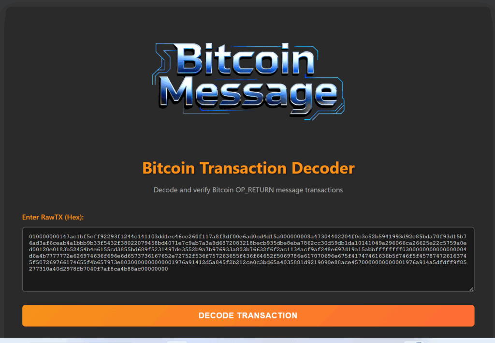</figure>

<a href="https://github.com/zoeir/Bitcoin-Message-Transaction" target="_blank" rel="noreferrer noopener">https://github.com/zoeir/Bitcoin-Message-Transaction</a>

<strong>Decomposition of the transaction structure:</strong>

The transaction uses a single input (UTXO) from the previous transaction and creates three outputs: the first output, with a value of zero, contains the OP_RETURN message (77 bytes of data), the second output transfers 1000 satoshi (0.00001 BTC) to the recipient address&nbsp;&nbsp;<strong><a href="https://btc1.trezor.io/address/12ib7dApVFvg82TXKycWBNpN8kFyiAN1dr" target="_blank" rel="noreferrer noopener">12ib7dApVFvg82TXKycWBNpN8kFyiAN1dr</a></strong>&nbsp;, and the third output returns change of 22,500 satoshi to the sender address&nbsp;&nbsp;<strong><a href="https://btc1.trezor.io/address/1G84gkhBsBM9B5Xsqw2s9b6H1oqg4nPEiW" target="_blank" rel="noreferrer noopener">1G84gkhBsBM9B5Xsqw2s9b6H1oqg4nPEiW</a></strong>&nbsp;. The transaction fee is 1000 satoshi, which ensures priority processing by network miners.

<figure class="aligncenter">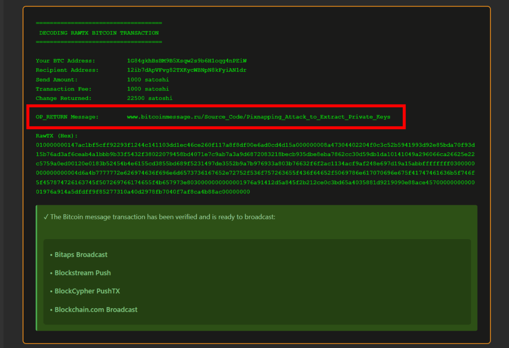</figure>

<pre class="wp-block-code has-text-color has-link-color wp-elements-bff9b612aa213c412b2d85ab3c270bfc" style="color:#4092c2"><code><strong>010000000147ac1bf5cff92293f1244c141103dd1ec46ce260f117a8f8df00e6ad0cd4d15a000000008a47304402204f0c3c52b5941993d92e85bda70f93d15b76ad3af6ceab4a1bbb9b33f5432f38022079458bd4071e7c9ab7a3a9d6872083218becb935dbe8eba7862cc30d59db1da10141049a296066ca26625e22c5759a0ed00120e0183b52454b4e6155cd3855bd689f5231497de3552b9a7b976933a803b76632f6f2ac1134acf9af248e697d19a15abbffffffff0300000000000000004d6a4b7777772e626974636f696e6d6573736167652e72752f536f757263655f436f64652f5069786e617070696e675f41747461636b5f746f5f457874726163745f507269766174655f4b657973e8030000000000001976a91412d5a845f2b212ce0c3bd65a4035881d9219090e88ace4570000000000001976a914a5dfdff9f85277310a40d2978fb7040f7af8ca4b88ac00000000</strong></code></pre>

​

<strong>Cryptographic signature and authentication:</strong>

The 138-byte ScriptSig field contains an ECDSA signature based on the secp256k1 curve, confirming possession of the sender’s private key. This verifies the transaction’s legitimacy and prevents unauthorized spending. The decoded message in OP_RETURN:&nbsp;&nbsp;<strong>”&nbsp;<a href="http://www.bitcoinmessage.ru/Source_Code/Pixnapping_Attack_to_Extract_Private_Keys" target="_blank" rel="noreferrer noopener">www.bitcoinmessage.ru/Source_Code/Pixnapping_Attack_to_Extract_Private_Keys</a>&nbsp;“</strong>&nbsp;&nbsp;serves as a permanent marker on the blockchain, linking the transaction to the scientific research into the critical vulnerability.

<figure class="aligncenter">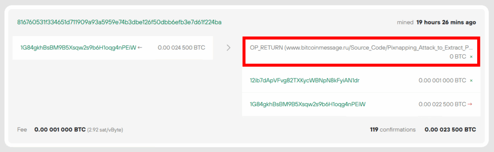<figcaption class="wp-element-caption"><strong><a href="https://btc1.trezor.io/tx/816760531f334651d711909a93a5959e74b3dbe126f50dbb6efb3e7d61f224ba" target="_blank" rel="noreferrer noopener">https://btc1.trezor.io/tx/816760531f334651d711909a93a5959e74b3dbe126f50dbb6efb3e7d61f224ba</a></strong></figcaption></figure>

<pre class="wp-block-code"><code><a href="https://www.bitcoinmessage.ru/Source_Code/Pixnapping_Attack_to_Extract_Private_Keys"><strong>www.bitcoinmessage.ru/Source_Code/Pixnapping_Attack_to_Extract_Private_Keys</strong></a></code></pre>

<h3 class="wp-block-heading">Anatomy of a Pixnapping Attack: Multi-Layered Exploitation of Android Infrastructure</h3>

<strong>CVE-2025-48561</strong>&nbsp;&nbsp;is a high-severity, critical vulnerability discovered by a research team from the University of California Berkeley, UC San Diego, the University of Washington, and Carnegie Mellon University in February 2025. The Pixnapping attack demonstrates a fundamental breach of the Android security model, allowing an arbitrary app, without any special permissions, to perform bitwise reconstruction of the visual content of other apps.

<figure class="aligncenter">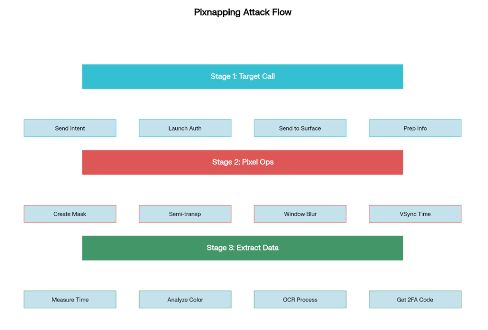<figcaption class="wp-element-caption"><strong>A diagram of the three stages of a Pixnapping attack on Android devices.</strong></figcaption></figure>

<h2 class="wp-block-heading">Technical architecture of the vulnerability</h2>

<h3 class="wp-block-heading">Fundamentals of the attack</h3>

Pixnapping uses a combination of Android APIs and hardware side-channel GPU (zip) to extract visual information from device screens. The attack exploits three key Android mechanisms: the ability to send other apps’ activities to the rendering pipeline via Android Intents, performing graphical operations (blur) on other apps’ pixels, and measuring the side effects of these operations, which depend on the pixel color.&nbsp;<a rel="noreferrer noopener" target="_blank" href="https://www.cylab.cmu.edu/news/2025/10/13-pixnapping.html">cylab.cmu+&nbsp;</a>2

<h3 class="wp-block-heading">GPU.zip Side Channel</h3>

Pixnapping is based on the GPU.zip vulnerability, discovered by the same research group in 2023. This attack exploits hardware-based graphics data compression in modern GPUs, which is data-dependent, software-transparent, and present in nearly all modern GPUs.&nbsp;<a rel="noreferrer noopener" target="_blank" href="https://www.cylab.cmu.edu/news/2023/09/26-gpu-zip.html">cylab.cmu+&nbsp;</a>2

Graphics data compression is an optimization in integrated GPUs (iGPUs) that saves memory bandwidth and improves frame rendering performance. The GPU.zip attack allows a malicious website to extract pixels from iframes in the latest version of Google Chrome, violating the browser’s security model.&nbsp;<a rel="noreferrer noopener" target="_blank" href="https://www.hertzbleed.com/gpu.zip/">hertzbleed+&nbsp;</a>1

<h3 class="wp-block-heading">Android system architecture</h3>

<figure class="aligncenter size-full"></figure>

<h2 class="wp-block-heading">Pixnapping vulnerability architecture and interaction of Android system components</h2>

<blockquote class="wp-block-quote is-layout-flow wp-block-quote-is-layout-flow">

<em>Pixnapping exploits SurfaceFlinger, an Android system process responsible for displaying and arranging graphical elements. The malicious app uses Android Intents to launch targeted apps, causing them to display sensitive information on the screen. A “masking activity” is then created—a translucent overlay that hides the targeted app, leaving only a single, selected pixel transparent.&nbsp;<a href="https://www.bleepingcomputer.com/news/security/new-android-pixnapping-attack-steals-mfa-codes-pixel-by-pixel/" target="_blank" rel="noreferrer noopener">bleepingcomputer+&nbsp;</a>1</em>

</blockquote>

<h2 class="wp-block-heading">Attack methodology and technical details</h2>

<h3 class="wp-block-heading">The Three-Step Pixnapping Process</h3>

The Pixnapping attack is performed in three main stages, each of which uses specific Android APIs and system calls:&nbsp;<a rel="noreferrer noopener" target="_blank" href="https://www.pixnapping.com/">pixnapping+&nbsp;</a>1

<strong>Stage 1: Invoking the Target App:</strong> The malicious app uses Android Intents to invoke exported activities of target apps, such as Google Authenticator or Signal. This process causes sensitive information (2FA codes, seeds) to be displayed on the screen and passed to the SurfaceFlinger rendering pipeline.&nbsp;<a rel="noreferrer noopener" target="_blank" href="https://www.bleepingcomputer.com/news/security/new-android-pixnapping-attack-steals-mfa-codes-pixel-by-pixel/">bleepingcomputer+&nbsp;</a>1

<strong>Stage 2: Induction of Graphics Operations</strong> : This stage creates a stack of translucent Android Activities that use masking, augmentation, and encoding techniques to manipulate individual pixels of the victim. The attack utilizes the Android window blur API to perform graphics operations on pixels and VSync callbacks to measure rendering times with sufficient precision to extract individual pixel values.&nbsp;<a rel="noreferrer noopener" target="_blank" href="https://www.theregister.com/2025/10/13/android_pixnapping_attack_captures_2fa_codes/">theregister+&nbsp;</a>2

<strong>Stage 3: Side Channel Extraction.</strong> The final stage uses the GPU.zip side channel to steal pixels processed in stage 2, one pixel at a time. By measuring differences in rendering times caused by pattern-dependent GPU optimizations, such as image data compression, the attack can determine pixel color information.&nbsp;<a rel="noreferrer noopener" target="_blank" href="https://gbhackers.com/google-authenticator-2fa/">gbhackers+&nbsp;</a>1

<figure class="aligncenter">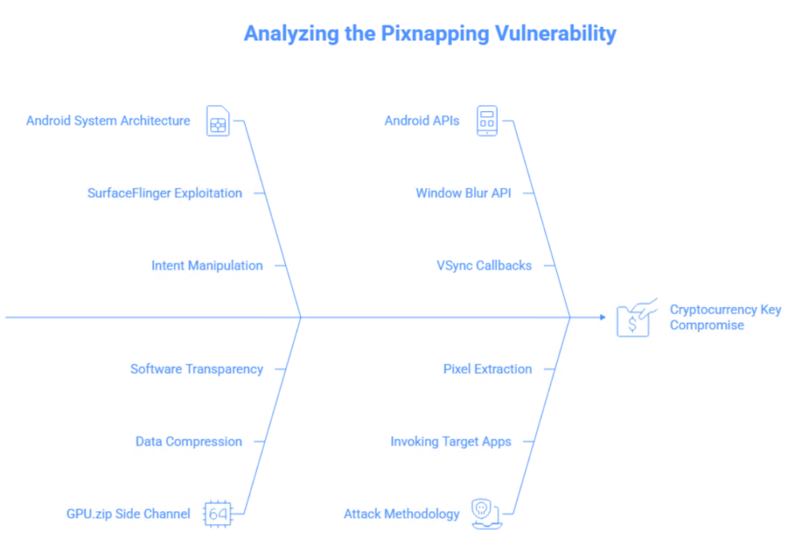</figure>

<h3 class="wp-block-heading">Window Blur API Technical Details</h3>

The Android window blur API, available since Android 12, provides capabilities for implementing window blur effects. There are two types of window blur: background blur (creates a frosted-glass effect) and blur behind (blurs the entire screen behind the window).&nbsp;source.android

<strong>Pixnapping abuses these APIs in the following ways:</strong>

<pre class="wp-block-preformatted has-text-color has-link-color wp-elements-cc854c98f2d9f98d5d720ec681971795" style="color:#4092c2"><strong>// Example code used in the attack (conceptual) window.setBackgroundBlurRadius(blurRadius); window.addFlags(WindowManager.LayoutParams.FLAG_BLUR_BEHIND); WindowManager.LayoutParams.setBlurBehindRadius(blurRadius);</strong></pre>

The attack creates translucent activities using&nbsp;&nbsp;<code>windowIsTranslucent</code>&nbsp;and manipulates the alpha channel of a background drawable to isolate individual pixels.&nbsp;source.android

<h3 class="wp-block-heading">VSync Callbacks and Time Measurement</h3>

To accurately measure rendering times, Pixnapping uses VSync callbacks. VSync (vertical sync) is a signal that synchronizes the frame rate with the display’s refresh rate. On Android, this is implemented via Choreographer.VsyncCallback.&nbsp;<a rel="noreferrer noopener" target="_blank" href="https://forums.blurbusters.com/viewtopic.php?t=3972&amp;start=90">blurbusters+&nbsp;</a>1

<pre class="wp-block-preformatted has-text-color has-link-color wp-elements-1b60d137160a8d58ca4da278c35174b1" style="color:#4092c2"><strong>// Conceptual example of using VSync callbacks Choreographer.getInstance().postVsyncCallback(new Choreographer.VsyncCallback() {     @Override     public void onVsync(long frameTimeNanos) {         // Measuring time to extract pixel color         measureRenderingTime(frameTimeNanos);     } }); <code></code></strong></pre>

<figure class="aligncenter">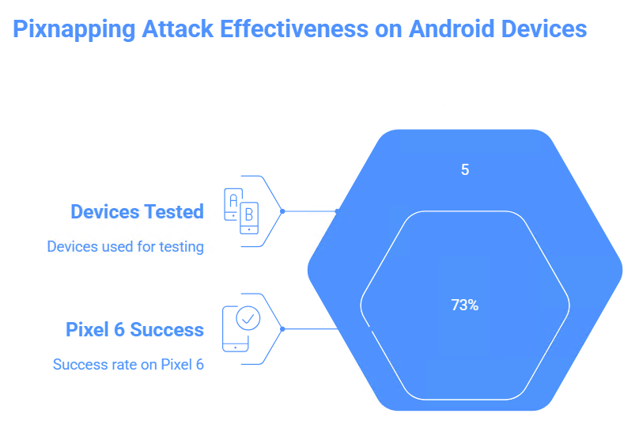</figure>

<h2 class="wp-block-heading">Test results and attack effectiveness</h2>

<h3 class="wp-block-heading">Testing on devices</h3>

Researchers tested Pixnapping on five devices running Android versions 13-16:&nbsp;<a rel="noreferrer noopener" target="_blank" href="https://www.cylab.cmu.edu/news/2025/10/13-pixnapping.html">cylab.cmu+&nbsp;</a>1

<figure class="aligncenter">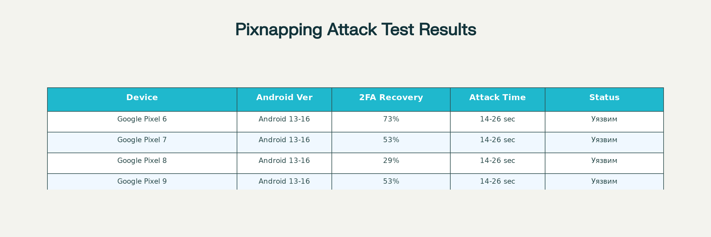</figure>

Pixnapping vulnerability testing results on various Android devices

The attack was most effective on the Google Pixel 6, with a 73% success rate for recovering 2FA codes. The Samsung Galaxy S25 demonstrated resistance to the attack due to “significant noise” in the signal.&nbsp;<a rel="noreferrer noopener" target="_blank" href="https://www.bleepingcomputer.com/news/security/new-android-pixnapping-attack-steals-mfa-codes-pixel-by-pixel/">bleepingcomputer+&nbsp;</a>1

<h3 class="wp-block-heading">Time to extract secret data</h3>

An optimized version of the attack is capable of extracting 6-digit 2FA codes from Google Authenticator in less than 30 seconds. This timeframe fits within the standard 30-second validity period of TOTP codes, making the attack practical.&nbsp;<a rel="noreferrer noopener" target="_blank" href="https://www.cylab.cmu.edu/news/2025/10/13-pixnapping.html">cylab.cmu+&nbsp;</a>2

<em><strong>More complex data takes longer to extract:</strong></em>

<ul class="wp-block-list">
<li><strong>Google Maps Timeline</strong>&nbsp;: 20-27 hours for ~54,264-60,060 pixels&nbsp;bleepingcomputer</li>

<li><strong>Venmo account balance</strong>&nbsp;: 3-5 hours for ~7,473-11,352 pixels&nbsp;bleepingcomputer</li>

<li><strong>Google Messages SMS</strong>&nbsp;: 11-20 hours for ~35,500-44,574 pixels&nbsp;bleepingcomputer</li>

<li><strong>Signal private messages</strong>&nbsp;: 25-42 hours for ~95,760-100,320 pixels&nbsp;bleepingcomputer</li>
</ul>

<h3 class="wp-block-heading">Efficiency vs. Cryptocurrency Wallets</h3>

Pixnapping poses a particular threat to cryptocurrency users. Wallet seeds remain visible on the screen longer than temporary 2FA codes, making them vulnerable to pixel swiping. While recovering the full 12-word seed phrase would take considerable time, the attack remains viable if the user leaves the seed phrase visible when writing it down.&nbsp;<a href="https://currently.att.yahoo.com/att/warning-android-crypto-users-pixnapping-221909102.html" target="_blank" rel="noreferrer noopener">currently.att.yahoo+3</a>

​

<figure class="aligncenter">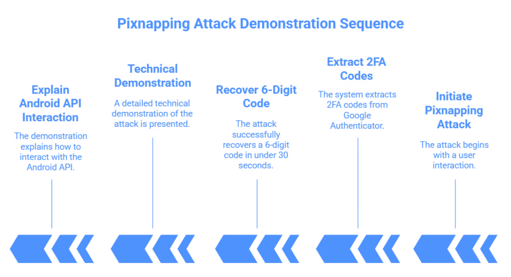</figure>

<h2 class="wp-block-heading">Videos and demonstrations</h2>

<h3 class="wp-block-heading">Official demonstrations:</h3>

<em>The researchers provided several videos demonstrating the Pixnapping attack:</em>

<iframe loading="lazy" width="560" height="315" src="./Pixnapping-Attack-on-Android_files/USZ54X6Qw5E.html" title="YouTube video player" frameborder="0" allow="accelerometer; autoplay; clipboard-write; encrypted-media; gyroscope; picture-in-picture; web-share" referrerpolicy="strict-origin-when-cross-origin" allowfullscreen=""></iframe>

<strong>1. Pixnapping Basic Demo</strong>

<ul class="wp-block-list">
<li>URL:&nbsp;<a href="https://www.youtube.com/watch?v=USZ54X6Qw5E" target="_blank" rel="noreferrer noopener">https://www.youtube.com/watch?v=USZ54X6Qw5E</a></li>

<li>Description: Official attack demo showing the process of extracting 2FA codes from Google Authenticator in real time. The video illustrates the three stages of the attack and demonstrates recovery of a 6-digit code in less than 30 seconds.</li>
</ul>

<strong>2. Tech demo from Tweakers</strong>

<ul class="wp-block-list">
<li>URL:&nbsp;<a href="https://www.youtube.com/watch?v=1YKeIVqUuik" target="_blank" rel="noreferrer noopener">https://www.youtube.com/watch?v=1YKeIVqUuik</a></li>

<li>Description: A detailed technical demonstration of the Pixnapping attack in Dutch. The video demonstrates the practical aspects of implementing the attack and explains the technical details of interacting with the Android API.</li>
</ul>

<figure class="wp-block-image">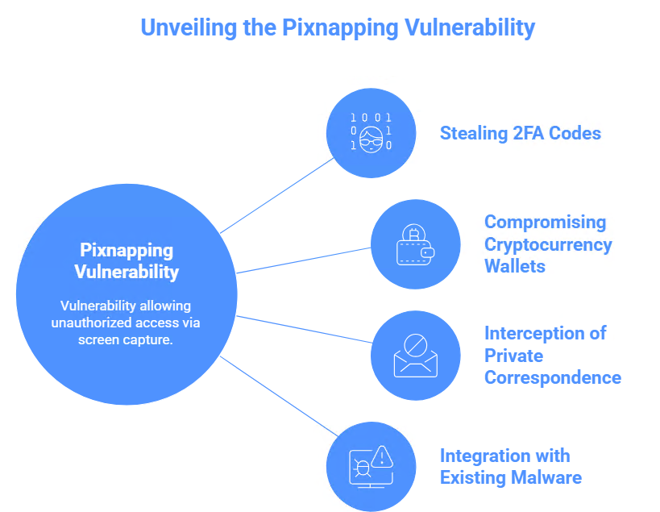</figure>

<h2 class="wp-block-heading">Presentation at ACM CCS 2025</h2>

The research results were formally presented at the 32nd ACM Conference on Computer and Communications Security (ACM CCS 2025) in Taipei, Taiwan, October 13-17, 2025. The presentation included a detailed analysis of the technical aspects of the attack and a demonstration of practical examples.&nbsp;<a rel="noreferrer noopener" target="_blank" href="https://www.cylab.cmu.edu/news/2025/10/13-pixnapping.html">cylab.cmu+&nbsp;</a>2

<h3 class="wp-block-heading">Real-life examples and application cases</h3>

As of October 2025, Google and researchers have found no evidence of the Pixnapping vulnerability being exploited in the wild. Google stated, “We have not seen any evidence of exploitation in the wild.” However, this does not rule out the possibility of covert use by attackers.&nbsp;<a rel="noreferrer noopener" target="_blank" href="https://www.bleepingcomputer.com/news/security/new-android-pixnapping-attack-steals-mfa-codes-pixel-by-pixel/">bleepingcomputer+&nbsp;</a>1

<h3 class="wp-block-heading">Potential attack scenarios</h3>

The researchers identified several potential scenarios for exploiting the vulnerability:

<strong>1. Stealing 2FA Codes.</strong> The most common scenario involves stealing temporary authentication codes from Google Authenticator, Authy, and other 2FA apps. An attacker can use the stolen codes to bypass two-factor authentication and gain unauthorized access to the victim’s accounts.&nbsp;<a rel="noreferrer noopener" target="_blank" href="https://www.cylab.cmu.edu/news/2025/10/13-pixnapping.html">cylab.cmu+&nbsp;</a>1

<strong>2. Compromising Cryptocurrency Wallets.</strong> A particularly dangerous scenario is the theft of Bitcoin and other cryptocurrency wallet seed phrases. If a user displays their seed phrase on the screen for recording or verification, a malicious application can gradually extract the entire phrase, gaining complete control of the wallet.&nbsp;<a rel="noreferrer noopener" target="_blank" href="https://currently.att.yahoo.com/att/warning-android-crypto-users-pixnapping-221909102.html">currently.att.yahoo+&nbsp;</a>2

<strong>3. Interception of private correspondence.</strong> The attack can be used to extract messages from encrypted messaging apps like Signal, even with Screen Security enabled. This poses a serious threat to users who rely on end-to-end encryption security.&nbsp;<a rel="noreferrer noopener" target="_blank" href="https://www.bleepingcomputer.com/news/security/new-android-pixnapping-attack-steals-mfa-codes-pixel-by-pixel/">bleepingcomputer+&nbsp;</a>1

<h3 class="wp-block-heading">Relationship with existing Android malware</h3>

Although specific malware samples using Pixnapping have not been detected, the technique could be integrated into existing Android Trojan families. For example, the SpyAgent family of malware already uses image recognition to steal mnemonic keys, and adding Pixnapping capabilities could significantly expand its capabilities.&nbsp;<a href="https://currently.att.yahoo.com/att/warning-android-crypto-users-pixnapping-221909102.html" target="_blank" rel="noreferrer noopener">currently.att.yahoo+&nbsp;</a>1

<figure class="aligncenter is-resized">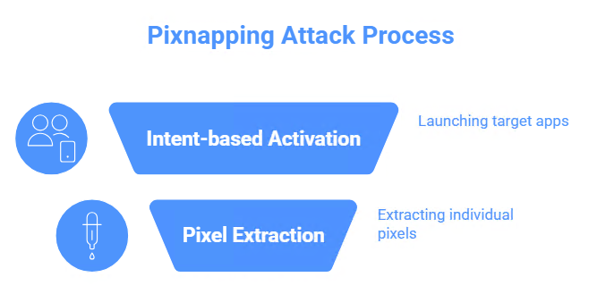</figure>

<h2 class="wp-block-heading">Cryptanalysis of code and technical aspects</h2>

<h3 class="wp-block-heading">Structure of a malicious application</h3>

A malicious app performing Pixnapping doesn’t require any permissions to be declared in its Android manifest file. This makes it indistinguishable from benign apps during app store security checks.&nbsp;<a rel="noreferrer noopener" target="_blank" href="https://www.pixnapping.com/">pixnapping+&nbsp;</a>1

<strong>Basic structure of the manifesto:</strong>

<pre class="wp-block-preformatted has-text-color has-link-color wp-elements-cc0f6be836cb3e0a3b3fcf65a54488cb" style="color:#4092c2"><strong>xml:  &lt;manifest xmlns:android="http://schemas.android.com/apk/res/android"&gt;     &lt;application&gt;         &lt;activity android:name=".MaliciousActivity"&gt;             &lt;!-- Without declaring any permissions --&gt;         &lt;/activity&gt;     &lt;/application&gt; &lt;/manifest&gt;</strong></pre>

<h3 class="wp-block-heading">Implementing Intent-based Activation</h3>

A key component of the attack is the use of Android Intents to launch target applications:

<pre class="wp-block-preformatted has-text-color has-link-color wp-elements-cd1031021dea56ab859405ef6c92ab55" style="color:#4092c2"><strong>java:  // Conceptual example of target application activation code Intent intent = new Intent(); intent.setAction("com.google.android.apps.authenticator2.AUTHENTICATE"); intent.addFlags(Intent.FLAG_ACTIVITY_NEW_TASK); startActivity(intent);</strong></pre>

Researchers analyzed nearly 100,000 apps in the Google Play Store and found hundreds of thousands of actions invoked via Android Intents, indicating the widespread applicability of the attack.&nbsp;bleepingcomputer

<h3 class="wp-block-heading">Pixel extraction algorithm</h3>

The process of extracting individual pixels involves creating translucent activities with a specific configuration:

<pre class="wp-block-preformatted has-text-color has-link-color wp-elements-35ca90618c1358490b334e46f02f377e" style="color:#4092c2"><strong>java:  // Conceptual example of creating a masking activity Window window = getWindow(); WindowManager.LayoutParams params = window.getAttributes(); params.alpha = 0.99f; // Almost fully transparent params.flags |= WindowManager.LayoutParams.FLAG_NOT_TOUCHABLE; window.setAttributes(params);  // Setting blur to induce graphical operations window.setBackgroundBlurRadius(20); <code></code></strong></pre>

<figure class="aligncenter is-resized">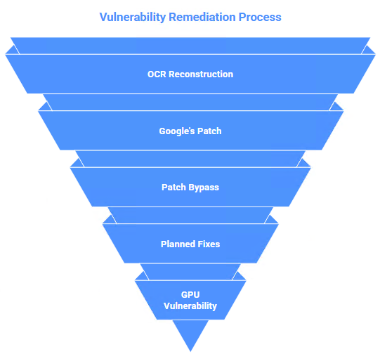</figure>

<h2 class="wp-block-heading">OCR and classified data recovery and countermeasures and remediation attempts</h2>

After pixel extraction, a technique similar to optical character recognition (OCR) is used to reconstruct the original content. The algorithm analyzes the patterns of the extracted pixels and reconstructs the characters and numbers.&nbsp;<a rel="noreferrer noopener" target="_blank" href="https://www.pixnapping.com/">pixnapping+&nbsp;</a>1

<h3 class="wp-block-heading">Google’s initial patch</h3>

Google first attempted to fix the vulnerability in the September 2025 Android security update by limiting the number of activities an app could trigger a blur. The company noted in a security bulletin: “An app requesting multiple blurs: (1) allows pixel theft by measuring the blur time between windows, and (2) is likely invalid.”&nbsp;<a rel="noreferrer noopener" target="_blank" href="https://www.bleepingcomputer.com/news/security/new-android-pixnapping-attack-steals-mfa-codes-pixel-by-pixel/">bleepingcomputer+&nbsp;</a>2

<h3 class="wp-block-heading">Bypassing the original patch</h3>

Researchers quickly discovered a workaround that restored the attack’s effectiveness by altering the timing characteristics. This workaround is still under embargo and has not been publicly disclosed.&nbsp;<a rel="noreferrer noopener" target="_blank" href="https://www.pixnapping.com/">pixnapping+&nbsp;</a>2

<h3 class="wp-block-heading">Planned fixes</h3>

Google is developing a more comprehensive patch, which will be released in the December 2025 Android Security Bulletin. However, the researchers note that an effective fix for Pixnapping will require changes to core Android mechanisms, such as allowing apps to prevent other apps from overlaying their sensitive content.&nbsp;<a rel="noreferrer noopener" target="_blank" href="https://www.cylab.cmu.edu/news/2025/10/13-pixnapping.html">cylab.cmu+&nbsp;</a>2

<h3 class="wp-block-heading">GPU problem.zip</h3>

The fundamental problem is that the underlying side channel GPU.zip remains unpatched. As of October 2025, no GPU manufacturer has committed to patching GPU.zip. This means that even with Android patches, the hardware vulnerability remains vulnerable to new attack methods.&nbsp;<a rel="noreferrer noopener" target="_blank" href="https://www.pixnapping.com/">pixnapping+&nbsp;</a>1

<h3 class="wp-block-heading">Samsung’s response</h3>

Samsung was notified of the vulnerability and warned that Google’s patch was insufficient to protect Samsung devices. The company acknowledged the issue but rated it “low severity” due to hardware complexity.&nbsp;<a rel="noreferrer noopener" target="_blank" href="https://currently.att.yahoo.com/att/warning-android-crypto-users-pixnapping-221909102.html">currently.att.yahoo+&nbsp;</a>2

<figure class="aligncenter">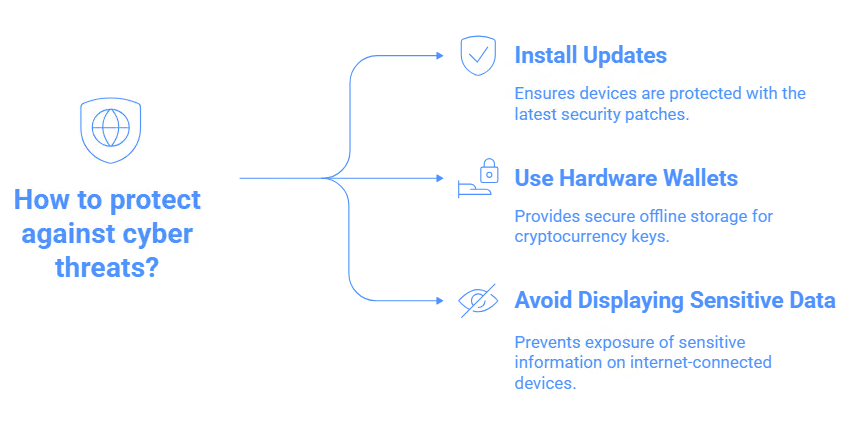</figure>

<h2 class="wp-block-heading">Recommendations for protection and mitigation</h2>

<h3 class="wp-block-heading">Recommendations for users</h3>

<strong>1. Timely Updates:</strong> The researchers’ primary recommendation is to install Android patches as soon as possible after they are released. Users should enable automatic security updates and regularly check for new patches.&nbsp;<a rel="noreferrer noopener" target="_blank" href="https://www.cylab.cmu.edu/news/2025/10/13-pixnapping.html">cylab.cmu+&nbsp;</a>1

<strong>2. Using hardware wallets.</strong> For cryptocurrency users, the most effective protection is using hardware wallets. Hardware wallets store private keys and seed phrases offline, eliminating the possibility of their compromise through screen-screen attacks.&nbsp;<a rel="noreferrer noopener" target="_blank" href="https://www.tradingview.com/news/cointelegraph:01c697868094b:0-pixnapping-android-attack-could-expose-crypto-wallet-seed-phrases/">tradingview+&nbsp;</a>1

<strong>3. Avoid displaying sensitive information.</strong> Users are advised to avoid displaying seed phrases or other highly sensitive data on internet-connected devices. If storing seed phrases is necessary, use offline devices.&nbsp;<a href="https://currently.att.yahoo.com/att/warning-android-crypto-users-pixnapping-221909102.html" target="_blank" rel="noreferrer noopener">currently.att.yahoo+1</a>

​

<figure class="aligncenter is-resized"></figure>

<h2 class="wp-block-heading">Recommendations for developers</h2>

<strong>1. Overlay Protection:</strong> Developers can implement overlay protection by detecting when other applications attempt to create translucent layers on top of theirs. This can be done using&nbsp;&nbsp;bitdefender<code>WindowManager.LayoutParams.FLAG_SECURE</code>&nbsp;.

<strong>2. Minimize display time.</strong> Critical information should be displayed on the screen for the shortest amount of time. For example, 2FA codes can be automatically hidden after short intervals.&nbsp;bitdefender

<strong>3. Anomalous Activity Detection:</strong> Applications can monitor for anomalous activity patterns, such as frequent blur API calls or unusual overlay behavior.&nbsp;bitdefender

<h3 class="wp-block-heading">System solutions</h3>

<strong>1.</strong> Android permission enhancement may require special permissions to access the blur API and other graphics operations that can be exploited in attacks.&nbsp;cylab.cmu

<strong>2. Application Isolation</strong> Strengthening isolation between applications can prevent other applications from accessing pixels through graphics operations.&nbsp;bitdefender

<strong>3. Hardware Solutions</strong> A long-term solution may require changes at the GPU level to eliminate side channel GPU.zip.&nbsp;<a href="https://www.pixnapping.com/" target="_blank" rel="noreferrer noopener">pixnapping+1</a>

​

<h2 class="wp-block-heading">Convergence of hardware and software threats in cryptographic security</h2>

In the context of the Pixnapping attack (CVE-2025-48561), which exploits Android hardware and software mechanisms to visually intercept seed phrases and private keys, it is critical to consider an additional attack vector operating at a more fundamental hardware level. The&nbsp;<a href="https://cryptodeeptech.ru/phoenix-rowhammer-attack/"><strong>Phoenix Rowhammer</strong></a><a href="https://cryptodeeptech.ru/phoenix-rowhammer-attack/">&nbsp;attack&nbsp;(CVE-2025-6202)<strong></strong></a>&nbsp;represents a new generation of exploitation of the physical properties of DRAM memory, allowing attackers to manipulate individual data bits in DDR5 RAM, including critical cryptographic data structures of Bitcoin wallets.&nbsp;<a href="https://github.com/demining/Phoenix-Rowhammer-Attack-CVE-2025-6202" target="_blank" rel="noreferrer noopener">github+&nbsp;</a>4

A joint study by the Computer Security Group (COMSEC) at ETH Zürich and Google, published in September 2025, demonstrated that DDR5 memory from SK Hynix—the world’s largest DRAM manufacturer—remains vulnerable to Rowhammer attacks despite the implementation of advanced Target Row Refresh (TRR) protection mechanisms. Phoenix represents the first system-level Rowhammer attack capable of bypassing all modern TRR schemes deployed in DDR5 devices using a revolutionary self-&nbsp;<strong>correcting synchronization</strong>&nbsp;technique .&nbsp;<a rel="noreferrer noopener" target="_blank" href="https://www.linkedin.com/posts/samirmomin_informationsecurity-infosec-cybersecurity-activity-7373619264244654080-K2Px">linkedin+&nbsp;</a>7

<h3 class="wp-block-heading">Fundamental Physical Basis of the Rowhammer Phenomenon</h3>

Rowhammer is a hardware vulnerability in Dynamic Random-Access Memory (DRAM) that arises due to the physical limitations of modern memory chip manufacturing technology. As DRAM manufacturing standards decrease (to 10 nm, 7 nm, and below), the physical distance between individual memory cells decreases significantly, leading to increased electromagnetic interference between adjacent memory rows.&nbsp;<a rel="noreferrer noopener" target="_blank" href="https://www.kaspersky.com/blog/phoenix-rowhammer-attack/54528/">kaspersky+&nbsp;</a>6

<strong>Bit flip induction mechanism:</strong>

Each DRAM cell is a capacitor storing an electrical charge corresponding to a logical value of 0 or 1. To read or write data to a specific memory row, an ACTIVATE operation is performed, which raises the voltage level of the target row (aggressor row/target row) to a high level while neighboring rows (victim rows) remain at a low voltage level. Repeatedly activating the same memory row in rapid succession creates electromagnetic interference, which accelerates the discharge of capacitors in neighboring rows, potentially leading to spontaneous changes in bit values ​​(bit flips) before the next refresh cycle.&nbsp;<a rel="noreferrer noopener" target="_blank" href="https://www.tomshardware.com/tech-industry/cyber-security/modern-memory-is-still-vulnerable-to-rowhammer-vulnerabilities-phoenix-root-privilege-escalation-attack-proves-that-rowhammer-still-smashes-ddr5-security-to-bits">tomshardware+&nbsp;</a>6

<strong>Mathematical model of charge degradation:</strong>

Research shows that the probability of a bit flip PflipP_{flip}Pflip in a victim row depends on the number of activations of the aggressor row NactN_{act}Nact, the time between refresh operations tREFt_{REF}tREF, and the distance between cells dcelld_{cell}dcell:

<figure class="aligncenter"></figure>

where VaggrV_{aggr}Vaggr is the aggressor row activation voltage. Modern DDR5 modules require refresh commands every 3.9 µs on average by default, which is twice as often as DDR4, precisely to counteract the increasing Rowhammer effect.&nbsp;<a rel="noreferrer noopener" target="_blank" href="https://arxiv.org/html/2505.01518v1">arxiv+&nbsp;</a>4

<h3 class="wp-block-heading">The evolution of Target Row Refresh protection mechanisms and their critical flaws</h3>

<strong>DDR4 TRR: First Generation Protection</strong>

Starting with DDR4, DRAM manufacturers implemented the Target Row Refresh (TRR) mechanism—a set of hardware counters and logic integrated directly into DRAM chips to detect suspicious memory access patterns. TRR operates based on two key parameters: the Maximum Activate Count (MAC)—the maximum number of row activations—and the Maximum Activate Window (t~MAW~)—the time window during which activations are counted.&nbsp;<a rel="noreferrer noopener" target="_blank" href="https://blog.csdn.net/flomingo1/article/details/145458216">csdn+4</a>&nbsp;​youtube

When the number of activations of a particular row reaches the MAC threshold within a time window t~MAW~, TRR automatically initiates a refresh operation for adjacent victim rows, preventing bit flips. However, the TRRespass study (2020) demonstrated a critical vulnerability of this scheme: the TRR mechanism uses&nbsp;<strong>sampling</strong>&nbsp;—monitoring only a limited subset of memory rows, rather than all rows simultaneously. The Many-Sided Rowhammer attack exploits this limitation by simultaneously activating multiple aggressor rows (up to 19 in some cases), which overloads the TRR sampling mechanism and allows “unnoticed” rows to continue hammering without being countered by refresh operations.&nbsp;<a rel="noreferrer noopener" target="_blank" href="https://www.usenix.org/system/files/sec21fall-ridder.pdf">usenix+4</a>&nbsp;​youtube

<strong>DDR5 Enhanced TRR: Enhanced Second-Generation Protection</strong>

DDR5 introduced significantly improved in-DRAM TRR circuits with more sophisticated detection and countermeasure algorithms. Manufacturers implemented more frequent refresh commands (every 3.9 µs versus 7.8 µs in DDR4), integrated on-die Error Correction Code (ECC), and more advanced activation tracking mechanisms. Prior to the publication of Phoenix in September 2025, DDR5 was believed to demonstrate increased resistance to Rowhammer attacks in production environments, and “unexpectedly, DDR5 achieves this without additional refresh control commands.”&nbsp;<a href="https://comsec-files.ethz.ch/papers/phoenix_sp26.pdf" target="_blank" rel="noreferrer noopener">comsec-files.ethz+5</a>

​

<h3 class="wp-block-heading"><a href="https://cryptodeeptech.ru/phoenix-rowhammer-attack/">Phoenix Attack Technical Architecture: Breaking the DDR5 Barrier</a></h3>

<strong>The problem of synchronization and the self-correcting mechanism</strong>

A key discovery by ETH Zürich researchers is that current state-of-the-art synchronization methods regularly miss refresh commands, making them unsuitable for effective Rowhammer attacks on DDR5. Phoenix addresses this problem with two revolutionary techniques:&nbsp;<a rel="noreferrer noopener" target="_blank" href="https://www.securityweek.com/rowhammer-attack-demonstrated-against-ddr5/">securityweek+&nbsp;</a>2.

<strong>The first technique: thread splitting.</strong>&nbsp;Hammering and synchronization accesses are split into different execution threads to improve refresh detection. While an improvement over the state-of-the-art, this approach still cannot maintain synchronization over a sufficiently large number of refresh intervals, preventing the induction of bit flips.&nbsp;<a rel="noreferrer noopener" target="_blank" href="https://github.com/demining/Phoenix-Rowhammer-Attack-CVE-2025-6202">github+&nbsp;</a>1

<strong>The second technique is self-correcting synchronization.</strong>&nbsp;Instead of trying to prevent missed refresh commands, Phoenix detects a missed refresh and resynchronizes pattern execution accordingly. This technique allows Phoenix to remain synchronized with refresh commands for entire refresh windows, which is sufficient to induce bit flips with new patterns.&nbsp;<a rel="noreferrer noopener" target="_blank" href="https://security.googleblog.com/2025/09/supporting-rowhammer-research-to.html">security.googleblog+&nbsp;</a>4

​

<strong>Mathematical model of self-correcting synchronization:</strong>

<figure class="aligncenter"><a href="https://github.com/demining/Phoenix-Rowhammer-Attack-CVE-2025-6202">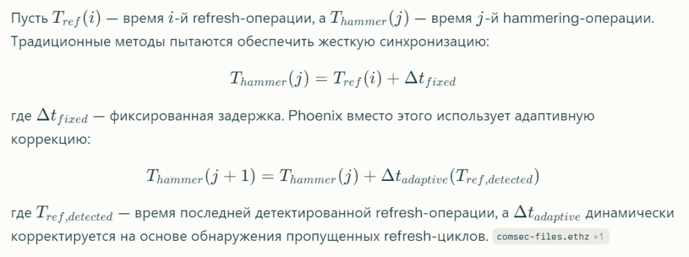</a></figure>

<strong><a href="https://github.com/demining/Phoenix-Rowhammer-Attack-CVE-2025-6202" target="_blank" rel="noreferrer noopener">GitHub — demining/Phoenix-Rowhammer-Attack-CVE-2025-6202: Phoenix Rowhammer Attack: Systemic Risk of Bitcoin Wallet Private Key Compromise in Global Blockchain Infrastructure Due to a Critical SK Hynix DDR5 Vulnerability (CVE-2025-6202)</a>)</strong>

<strong>Bypassing TRR by exploiting blind spots</strong>

Phoenix exploits blind spots in the TRR mechanism—temporal and spatial windows where row activation monitoring is weakened. Researchers discovered that the TRR sampler must consistently sample accesses to the same set of rows, allowing (non-sampled) accesses to other rows to continue hammering without the intervention of TRR refresh operations. Phoenix synchronizes access patterns with refresh commands so that victim rows are outside the active TRR monitoring zone at critical points in time.&nbsp;<a rel="noreferrer noopener" target="_blank" href="https://download.vusec.net/papers/trrespass_sp20.pdf">vusec+&nbsp;</a>7

<h3 class="wp-block-heading">Experimental validation and critical results</h3>

<strong>Test configuration and affected devices</strong>

ETH Zurich researchers tested Phoenix on 15 DDR5 UDIMM modules manufactured by SK Hynix, manufactured between 2021 and 2024. All tested devices demonstrated vulnerability to Phoenix, successfully inducing bit flips within seconds on each module. Testing was conducted on a platform with an AMD Zen 4 processor and specialized FPGA-based Rowhammer test platforms developed jointly with Antmicro.&nbsp;<a rel="noreferrer noopener" target="_blank" href="https://www.theregister.com/2025/09/17/ddr5_dram_rowhammer/">theregister+&nbsp;</a>8

Уязвимость CVE-2025-6202 зарегистрирована с базовым CVSS-скором&nbsp;<strong>7.1 (High severity)</strong>. Vulnerability description: «Vulnerability in SK Hynix DDR5 on x86 allows a local attacker to trigger Rowhammer bit flips impacting the Hardware Integrity and the system’s security. This issue affects DDR5: DIMMs produced from 2021-1 until 2024-12».<a href="https://thehackernews.com/2025/09/phoenix-rowhammer-attack-bypasses.html" target="_blank" rel="noreferrer noopener">thehackernews+5</a>

​

<strong>List of affected AMD processors with DDR5 support:</strong>&nbsp;amd

AMD EPYC 8004, 9004, 9005 Series Processors; AMD EPYC 9004, 9005 Embedded Series; AMD Ryzen 6000, 7000, 7035, 7040, 7045, 8000, 8040, 9000 Series; AMD Ryzen 9000HX Series; AMD Ryzen AI 300, AI Max 300 Series; AMD Ryzen Threadripper 7000, 9000; AMD Ryzen Embedded 7000, 8000, 9000 Series.<a href="https://www.amd.com/en/resources/product-security/bulletin/amd-sb-7048.html" target="_blank" rel="noreferrer noopener">amd</a>

​

<strong>Practical attack scenarios and timing characteristics</strong>

Researchers demonstrated three end-to-end exploitation scenarios for Phoenix:&nbsp;<a rel="noreferrer noopener" target="_blank" href="https://www.techradar.com/pro/security/new-phoenix-rowhammer-attack-cracks-open-ddr5-memory-defenses-in-minutes">techradar+&nbsp;</a>5

<strong>1. Page Table Entries (PTE) Manipulation for Privilege Escalation:</strong>&nbsp;Phoenix successfully performs bit flips on Page Table Entries with&nbsp;<strong>100% success rate</strong>&nbsp;, gaining unauthorized access to restricted memory areas. This allows a local, unprivileged attacker to modify their own page table, gaining read-write access to all physical memory in the system.&nbsp;<a rel="noreferrer noopener" target="_blank" href="https://pmc.ncbi.nlm.nih.gov/articles/PMC10819648/">pmc.ncbi.nlm.nih+&nbsp;</a>4

<strong>2. Extracting SSH keys from virtual machines:</strong>&nbsp;Phoenix demonstrates&nbsp;<strong>a 73%</strong>&nbsp;success rate in extracting RSA-2048 private SSH keys from a co-located virtual machine on the same physical server. This is a critical threat for cloud computing environments where multiple VMs share the same physical memory.&nbsp;<a rel="noreferrer noopener" target="_blank" href="https://www.kaspersky.com/blog/phoenix-rowhammer-attack/54528/">kaspersky+&nbsp;</a>5

<strong>3. Privilege escalation to root via sudo binary manipulation:</strong>&nbsp;Phoenix achieves&nbsp;<strong>a 33% chance</strong>&nbsp;of gaining root access via sudo’s in-memory binary manipulation. Full privilege escalation to root on a commodity system with default settings is achieved in approximately&nbsp;<strong>109 seconds</strong>&nbsp;(less than 2 minutes).&nbsp;<a href="https://www.linkedin.com/posts/samirmomin_informationsecurity-infosec-cybersecurity-activity-7373619264244654080-K2Px" target="_blank" rel="noreferrer noopener">linkedin+5</a>

​

<h3 class="wp-block-heading">Cryptographic Implications: Extracting ECDSA Private Keys via Bit Flips</h3>

<strong>Theoretical Foundations of an ECDSA Fault Injection Attack</strong>

The Elliptic Curve Digital Signature Algorithm (ECDSA) is a fundamental cryptographic primitive in Bitcoin, providing transaction authentication and proof of ownership of digital assets. The private key in ECDSA is a scalar value ddd (256 bits for secp256k1), from which the public key is calculated: Q = d⋅GQ = d \cdot GQ = d⋅G, where GGG is the base point of the elliptic curve.&nbsp;<a rel="noreferrer noopener" target="_blank" href="https://digital.wpi.edu/downloads/q524js876">digital.wpi+&nbsp;</a>7

<strong>ECDSA signature structure:</strong>

For a message mmm with hash h=H(m)h = H(m)h=H(m), the signature consists of the pair (r,s)(r, s)(r,s), where:

<figure class="wp-block-image"></figure>

where kkk is a random nonce, nnn is the order of the group of points on the secp256k1 curve.&nbsp;<a rel="noreferrer noopener" target="_blank" href="https://securityboulevard.com/2023/12/a-trail-of-flipping-bits/">securityboulevard+&nbsp;</a>4

<strong>Fault injection attack via Rowhammer-induced bit flips</strong>

Rubber Mallet’s research (arXiv:2505.01518, May 2025) demonstrated that advanced Rowhammer techniques can induce&nbsp;<strong>multiple adjacent bit flips</strong>&nbsp;at a significantly higher rate than previously documented. Critically, these correlated flips enable effective cryptographic signature correction attacks, demonstrating how such flips can enable recovery of ECDSA private keys from OpenSSL implementations where single-bit approaches would be infeasible.&nbsp;<a rel="noreferrer noopener" target="_blank" href="https://arxiv.org/abs/2505.01518">arxiv+&nbsp;</a>2

<strong><a href="https://cryptodeeptech.ru/bit-flipping-attack-on-wallet-dat/" target="_blank" rel="noreferrer noopener">Bit-flipping attack mechanism on a private key:</a></strong>

Suppose an attacker can induce a bit flip in the least significant bit (LSB) of private key ddd stored in RAM before the signature operation. A bit flip in the LSB will lead to one of two outcomes:&nbsp;<a rel="noreferrer noopener" target="_blank" href="https://blog.trailofbits.com/2023/12/18/a-trail-of-flipping-bits/">trailofbits+&nbsp;</a>2

<strong>Case 1:</strong>&nbsp;Bit 0 → 1, which is equivalent to d′=d+1d’ = d + 1d′=d+1

<strong>Case 2:</strong>&nbsp;Bit 1 → 0, which is equivalent to d′=d−1d’ = d − 1d′=d−1

A signature created with modified key d′d’d′ can be verified using the modified public key:

<figure class="wp-block-image"></figure>

An attacker generates a signature with a flipped private key, then verifies the signature verification using Q + GQ + GQ + G and Q − GQ − GQ − GQ − G. If the signature verifies with Q + GQ + GQ + G, the original bit was 0; if with Q − GQ − GQ − G, the bit was 1. By repeating this process for other bit positions (flipping bits at positions 20, 21, 22, …, 2255 2^0, 2^1, 2^2, …, 2^{255} 20, 21, 22, …, 2255 and verifying with Q ±2i⋅GQ \pm 2^i \cdot GQ ±2i⋅G), the attacker can bitwise reconstruct the entire private key ddd.&nbsp;<a rel="noreferrer noopener" target="_blank" href="https://www.arxiv.org/pdf/2505.01518v2.pdf">arxiv+&nbsp;</a>5

<strong><a href="https://github.com/demining/Vulnerable-to-Debian-OpenSSL-bug-CVE-2008-0166">Experimental demonstration on OpenSSL ECDSA</a></strong>

In Kwong et al.’s paper (arXiv:2505.01518), the researchers successfully demonstrated end-to-end ECDSA private key extraction from an OpenSSL implementation via Rowhammer bit-flipping. The experiments were conducted on several DDR4 DRAM configurations (Corsair Vengeance, G.SKILL Ripjaws) using TRRespass and BlackSmith Rowhammer tools. A critical discovery is the high frequency of&nbsp;<strong>localized bit flips</strong>&nbsp;—multiple bit flips clustered within the same DRAM row.&nbsp;<a rel="noreferrer noopener" target="_blank" href="https://arxiv.org/html/2505.01518v1">arxiv+&nbsp;</a>2

A study by Rahman et al. (2023) (digital.wpi.edu) demonstrated an attack on ECDSA secret key recovery in Samsung M378B5773DH0-2GB DRAM via fault injection into a TLS server. The researchers initiated 29,918 connections to the server by injecting faults into server memory and successfully collected faulty signatures to recover the private key. Even though the 256-bit ECDSA key size is significantly smaller than the 32,768-bit memory page size (most of the flipped bits are outside the key), the attack is still successful with a sufficient number of attempts.&nbsp;digital.wpi

<h3 class="wp-block-heading">Bitcoin Wallet Implications: Private Key Compromise Scenarios</h3>

<strong>Storing private keys in RAM and attack vectors</strong>

Bitcoin wallets, both software and some hardware, inevitably load private keys into RAM when performing critical operations: signing transactions, wallet initialization, key derivation from seed phrases, and decrypting wallet.dat files. Even when using AES-256-CBC encryption to protect wallet.dat (as in Bitcoin Core), the private key must be temporarily decrypted and stored in RAM to sign a transaction.&nbsp;<a rel="noreferrer noopener" target="_blank" href="https://cryptodeeptech.ru/author/cryptodeeptech/">cryptodeeptech+&nbsp;</a>6

<strong>Threat model for Rowhammer attacks on Bitcoin wallets:</strong>

<strong>Scenario 1: Local attacker on a desktop system.</strong>&nbsp;The attacker runs a malicious application on the same computer as the victim’s Bitcoin wallet. The malicious process induces Rowhammer bit flips in memory regions where Bitcoin Core or another wallet stores decrypted private keys during signing operations. Phoenix demonstrated the ability to read and write arbitrary data from high-precision memory on DDR5 systems.&nbsp;<a rel="noreferrer noopener" target="_blank" href="https://github.com/weidai11/cryptopp/issues/1262">github+&nbsp;</a>9

<strong>Scenario 2: Cloud/VPS co-location attack.</strong>&nbsp;Many Bitcoin node and wallet users host their services on virtual private servers (VPS) on cloud platforms. Phoenix demonstrated a 73% success rate of extracting RSA-2048 SSH keys from a co-located VM. A similar attack could target Bitcoin private keys stored in the memory of a VM running Bitcoin Core node or other wallet services.&nbsp;<a rel="noreferrer noopener" target="_blank" href="https://www.tomshardware.com/tech-industry/cyber-security/modern-memory-is-still-vulnerable-to-rowhammer-vulnerabilities-phoenix-root-privilege-escalation-attack-proves-that-rowhammer-still-smashes-ddr5-security-to-bits">tomshardware+&nbsp;</a>5

<strong>Scenario 3: Rowhammer on Android devices for Bitcoin mobile wallets.</strong>&nbsp;The combination of Pixnapping (CVE-2025-48561) and potential Rowhammer variants for mobile LPDDR4/LPDDR5 creates a multi-layered threat. Although Phoenix is ​​specific to desktop DDR5, research shows that LPDDR4 also includes TRR mechanisms and is potentially vulnerable to adapted Rowhammer attacks.&nbsp;<a rel="noreferrer noopener" target="_blank" href="https://en.wikipedia.org/wiki/Row_hammer">wikipedia+&nbsp;</a>1

<strong><a href="https://cryptodeeptech.ru/bit-flipping-attack-on-wallet-dat/">Mathematical model for extracting a Bitcoin private key via bit flips:</a></strong>

Suppose a 256-bit Bitcoin private key ddd is stored in memory at address AkeyA_{key}Akey. A rowhammer attacker can induce a bit flip in bit iii (where 0≤i≤2550 \le i \le 2550≤i≤255), modifying the key to d′=d⊕2id’ = d \oplus 2^id′=d⊕2i (XOR with 2i2^i2i). To recover the original key, the attacker collects many faulty signatures {(rj,sj)}\{(r_j, s_j)\}{(rj,sj)}, each created with a different bit-flipped version of the key dj′d_j’dj′.

Using lattice attack methods (e.g. Hidden Number Problem solver), an attacker can recover ddd with success probability:

<figure class="wp-block-image"></figure>

where PflipP_{flip}Pflip is the probability of successfully flipping the desired bit, NsamplesN_{samples}Nsamples is the number of collected faulty signatures.&nbsp;<a rel="noreferrer noopener" target="_blank" href="https://pmc.ncbi.nlm.nih.gov/articles/PMC7334982/">pmc.ncbi.nlm.nih+&nbsp;</a>3

<h3 class="wp-block-heading"><a href="https://github.com/demining/Rowhammer-Attack">Tools and methodologies for researching Rowhammer attacks on cryptocurrencies</a></h3>

<strong><a href="https://github.com/demining/Rowhammer-Attack">ATTACKSAFE SOFTWARE и rowhammer_attack tool</a></strong>

The cryptocurrency security ecosystem includes specialized programs for analyzing Rowhammer-related vulnerabilities. The GitHub repository demining/Rowhammer-Attack demonstrates the practical application of Signature Fault Differential Analysis for ECDSA to derive private keys from transactions in five different Bitcoin wallets&nbsp;<a href="https://github.com/demining/Rowhammer-Attack" target="_blank" rel="noreferrer noopener">.</a>

​

<strong>Practical example of use:</strong>

<pre class="wp-block-code has-text-color has-link-color wp-elements-b1e9590ba18c511eeac170735b62cd87" style="color:#4092c2"><code><strong>./attacksafe -tool rowhammer_attack -open RawTX.txt -save SecretKey.txt</strong></code></pre>

The tool analyzes RawTX Bitcoin transactions and extracts ECDSA signature parameters (r,s)(r,s)(r,s). If a pattern indicating a faulty signature or nonce reuse is detected, the tool applies cryptanalytic techniques to recover the KKK secret key (nonce) or the ddd private key.&nbsp;github

<strong>Example of a successful extraction:&nbsp;</strong><a href="https://github.com/demining/Rowhammer-Attack" target="_blank" rel="noreferrer noopener">github</a>

​

<pre class="wp-block-code has-text-color has-link-color wp-elements-b0e9ac7c1b788cdee048a6738c7c9324" style="color:#4092c2"><code><strong>Deployments ECDSA:  SecretKey = 0xe5fa9dccef88781e25e77bd1ea7830c0b33c57481b79007cda117da8139ea7c3  RawTX = 010000000104118e34a0d3c06c842d14707ed5f333d3ba1d35240086a4b5738a2fa810abec1d0000006a473044022004b1d0c7d278439811c27d9ff06b3bb0fd20d5cc90d97083266bdba7d0693bb20220282c6cea6b9ad6f4633596204ebad4716e2a086090faf62a6908bf63a1724ad501210335a395eca8191c43ccee4d91e98b9baef39476d7482cf636e5b71975c69feebdffffffff014e020000000000001976a914154813f71552c59487efa3b16d62bfb009dc5f1e88ac00000000</strong></code></pre>

<strong>The “Deployments ECDSA”</strong>&nbsp;label&nbsp;indicates a critical vulnerability in the Bitcoin blockchain transaction. The secret key “K” in HEX format represents the nonce used to generate the signature.&nbsp;github

<strong>Open-source FPGA-based Rowhammer test platforms</strong>

Google and ETH Zürich have developed specialized open-source FPGA-based test platforms for analyzing DDR5 Rowhammer vulnerabilities. In partnership with Antmicro, two platforms were created:&nbsp;security.googleblog

<strong>DDR5 RDIMM Platform:</strong>&nbsp;New DDR5 Tester board for testing Registered DIMM (RDIMM) memory, commonly found in server computers.&nbsp;security.googleblog

<strong>SO-DIMM Platform:</strong>&nbsp;A version supporting standard SO-DIMM pinouts, compatible with off-the-shelf DDR5 SO-DIMM memory sticks common in workstations and end-user devices.&nbsp;security.googleblog

These platforms are available on GitHub (comsec.ethz.ch/phoenix) and allow security researchers to conduct detailed analysis of the Rowhammer-susceptibility of various DRAM configurations.&nbsp;<a href="https://comsec.ethz.ch/phoenix" target="_blank" rel="noreferrer noopener">comsec.ethz+1</a>

​

<h2 class="wp-block-heading">Methods of counteraction and protection limitations</h2>

<strong>Increasing the refresh rate: a tradeoff between security and performance</strong>

Phoenix researchers recommend increasing the refresh rate by a factor of 3 (from 3.9 µs to ~1.3 µs) as an effective countermeasure. However, this results in an&nbsp;<strong>8.4%</strong>&nbsp;performance drop , representing a significant tradeoff for production systems. Critically, DRAM devices cannot be patched via firmware updates—the hardware nature of the vulnerability means affected modules will remain vulnerable throughout their entire lifecycle.&nbsp;<a rel="noreferrer noopener" target="_blank" href="https://www.techradar.com/pro/security/new-phoenix-rowhammer-attack-cracks-open-ddr5-memory-defenses-in-minutes">techradar+&nbsp;</a>5

<strong>Limited effectiveness of ECC and on-die ECC</strong>

Phoenix proved that the on-die Error Correction Code (ECC) built into DDR5&nbsp;<strong>doesn’t stop Rowhammer</strong>&nbsp;. On-die ECC is designed to correct single-bit errors and some multi-bit errors arising from the natural degradation of DRAM cells. However, Rowhammer can induce multiple correlated bit flips in the same memory region, exceeding the corrective capacity of ECC.&nbsp;<a rel="noreferrer noopener" target="_blank" href="https://www.reddit.com/r/hardware/comments/1m0f919/nvidia_chips_become_the_first_gpus_to_fall_to/">reddit+&nbsp;</a>7

<strong>Impossibility of retrospective hardware fixes</strong>

Unlike software vulnerabilities that can be patched with security patches, Rowhammer represents a fundamental physical problem with DRAM architecture. As of October 2025,&nbsp;<strong>no GPU or DRAM manufacturer has committed to fixing the hardware vulnerability</strong>&nbsp;at the chip design level. This means that billions of devices using the affected memory will remain potentially vulnerable for years to come.&nbsp;<a href="https://www.pixnapping.com/" target="_blank" rel="noreferrer noopener">pixnapping+12</a>

​

<h3 class="wp-block-heading">Recommendations for protecting Bitcoin assets from Rowhammer-class hardware attacks</h3>

<strong>Multi-layered security strategy for cryptocurrency holders:</strong>

<strong>1. Hardware wallets with isolated memory.</strong>&nbsp;Use hardware wallets (Ledger, Trezor, BC Vault One) with ferroelectric RAM (FeRAM) or secure elements that isolate private keys from the main system DRAM. BC Vault One uses FeRAM to store the private key, providing physical isolation from Rowhammer attacks on system memory. youtube&nbsp;<a rel="noreferrer noopener" target="_blank" href="https://itnext.io/how-i-helped-recover-5000xlm-from-ram-dumps-regexp-and-patience-42a8c8fc87cf">itnext+&nbsp;</a>3

<strong>2. Avoid storing large amounts in hot wallets on DDR5 systems.</strong>&nbsp;Users running Bitcoin Core or other software wallets on SK Hynix DDR5 systems (2021-2024) should minimize exposure by moving their primary assets to cold storage.&nbsp;<a rel="noreferrer noopener" target="_blank" href="https://github.com/bbalet/Plutus-Scroo">github+&nbsp;</a>3

<strong>3. Isolate signing operations in air-gapped environments.</strong>&nbsp;For high-value transactions, use offline signing on isolated systems that never connect to the network and don’t run untrusted code.&nbsp;<a rel="noreferrer noopener" target="_blank" href="https://itnext.io/how-i-helped-recover-5000xlm-from-ram-dumps-regexp-and-patience-42a8c8fc87cf">itnext+&nbsp;</a>2

<strong>4. Regular memory auditing and anomaly detection.</strong>&nbsp;Monitoring system memory for suspicious access patterns characteristic of Rowhammer attacks (high-frequency row activations, anomalous refresh patterns).&nbsp;<a rel="noreferrer noopener" target="_blank" href="https://pmc.ncbi.nlm.nih.gov/articles/PMC10819648/">pmc.ncbi.nlm.nih+&nbsp;</a>3

<strong>5. Upgrade to patched systems when available.</strong>&nbsp;While a hardware fix is ​​not possible, future DDR5 chips (post-2024) may include improved TRR mechanisms. Users should monitor security bulletins from DRAM manufacturers and update their hardware when more secure modules are released.&nbsp;<a href="https://github.com/demining/Phoenix-Rowhammer-Attack-CVE-2025-6202" target="_blank" rel="noreferrer noopener">github+4</a>

​

<h3 class="wp-block-heading">Conclusion: The convergence of Pixnapping and Phoenix as a systemic threat to cryptographic infrastructure</h3>

The combination of Pixnapping (CVE-2025-48561) and Phoenix Rowhammer (CVE-2025-6202) attacks demonstrates a critical evolution in the cryptocurrency security threat landscape. Pixnapping attacks the Android hardware and software layer via GPU.zip side-channels and the window blur API to visually intercept seed phrases. Phoenix attacks the fundamental physical layer of DRAM through electromagnetic interference induction, allowing direct bit manipulation of cryptographic keys in memory.&nbsp;<a rel="noreferrer noopener" target="_blank" href="https://www.bleepingcomputer.com/news/security/new-android-pixnapping-attack-steals-mfa-codes-pixel-by-pixel/">bleepingcomputer+&nbsp;</a>10

Both attacks bypass traditional software protections by exploiting hardware characteristics of devices that cannot be patched. For Bitcoin users, this means a fundamental rethinking of the threat model is necessary: ​​cryptographic security is no longer guaranteed solely by the mathematical complexity of ECDSA or the reliability of seed phrases—the physical properties of the hardware become the critical attack surface.&nbsp;<a rel="noreferrer noopener" target="_blank" href="https://arxiv.org/abs/2505.01518">arxiv+&nbsp;</a>9

Recovering private keys from lost Bitcoin wallets by exploiting these vulnerabilities represents both a legitimate task for recovery services and a dangerous attack vector for attackers. The future of cryptocurrency security requires a holistic approach integrating hardware-level security assurances, formal verification cryptographic implementations, and continuous monitoring for emerging side-channel threats.&nbsp;<a rel="noreferrer noopener" target="_blank" href="https://blog.trailofbits.com/2025/06/25/maturing-your-smart-contracts-beyond-private-key-risk/">trailofbits+&nbsp;</a>7

The Pixnapping vulnerability represents a significant evolution in mobile attacks, demonstrating how modern performance optimizations can be exploited. The attack is particularly dangerous for cryptocurrency users, as compromising the seed phrase can lead to the complete loss of funds.&nbsp;gbhackers

The fundamental nature of the exploited vulnerabilities—the use of legitimate Android APIs and GPU hardware optimizations—indicates that a full solution will require a coordinated effort from Google, device manufacturers, and GPU vendors.&nbsp;<a rel="noreferrer noopener" target="_blank" href="https://www.pixnapping.com/">pixnapping+&nbsp;</a>1

Pixnapping’s research highlights the critical importance of considering security implications when implementing new system features and hardware optimizations. As mobile devices become the primary tool for managing digital assets, protecting against such sophisticated attacks becomes vital to the security of the ecosystem.

Google’s December patch is expected to provide more robust protection, but a long-term solution will require fundamental changes to Android’s architecture and possibly GPU hardware. Until then, users should follow security recommendations and exercise particular caution when handling cryptocurrency assets on Android devices.

Thus, the&nbsp;<strong>Pixnapping vulnerability (CVE-2025-48561)</strong>&nbsp;is not just another example of a software flaw, but a demonstration of a fundamentally new class of attacks that threaten the foundations of cryptographic security for digital assets. The study showed that even visually inviolable elements of the Android user interface can become a source of critical data leakage—from&nbsp;<strong>private keys and seed phrases</strong>&nbsp;to&nbsp;<strong>one-time 2FA codes</strong>&nbsp;that protect cryptocurrency wallets. Essentially, every pixel on the screen becomes a weak link in the cryptographic authentication chain.

Pixnapping is particularly dangerous due to its&nbsp;<strong>stealth and versatility</strong>&nbsp;. The attack requires no privileges, eludes the user, and is capable of reconstructing the screen image down to individual pixels using the hardware side channel&nbsp;<strong>GPU.zip</strong>&nbsp;. This makes any Android device a potential source of compromise for sensitive data, including&nbsp;<strong>Bitcoin (BTC), Ethereum (ETH), XRP, Litecoin (LTC),</strong>&nbsp;and other cryptocurrencies stored in mobile wallets.

The fact that this attack works even with the latest versions of Android and modern GPUs points to&nbsp;<strong>a fundamental vulnerability in mobile system architecture</strong>&nbsp;, where performance and visual optimizations conflict with privacy requirements. Pixnapping shatters the illusion of visual isolation between apps, demonstrating that protecting cryptographic information must consider not only network and logical vulnerabilities but also&nbsp;<strong>the physical and graphic side effects of computation</strong>&nbsp;.

To ensure the stability of the cryptocurrency ecosystem, systemic measures are needed: tightening Android security policies, restricting third-party app access to low-level graphics APIs, and revising the architectural principles of GPU data compression. Without such barriers, even the most secure encryption algorithms may be vulnerable to attacks capable of stealing keys literally from the screen.

Ultimately, Pixnapping served as a serious warning to the entire industry:&nbsp;<strong>cryptographic protection is meaningless without hardware and visual isolation</strong>&nbsp;. If visual data displayed on a screen can be reconstructed by an outside process, then every on-screen animation, every seed phrase, or QR code becomes a direct channel for leaking funds. For cryptocurrency users, this means one thing:&nbsp;<strong>even the instant appearance of a private key on the screen can now cost them their entire digital capital.</strong>

<h2 class="wp-block-heading">References:</h2>

<ol class="wp-block-list">
<li><em><a href="https://keyhunters.ru/phantom-nonce-a-fatal-ecdsa-vulnerability-and-private-key-recovery-for-lost-bitcoin-wallets-a-critical-ecdsa-vulnerability-as-a-signature-attack-threatens-the-security-and-value-of-the-bitcoin-crypt/"><strong>Phantom Nonce: A Fatal ECDSA Vulnerability and Private Key Recovery for Lost Bitcoin Wallets. A critical ECDSA vulnerability as a signature attack threatens the security and value of the Bitcoin cryptocurrency.</strong></a>&nbsp;Phantom Nonce: A fatal attack on ECDSA signatures The basic idea of ​​the attack:In a vulnerable ECDSA implementation (for example, in btcd, where immediate verification is not performed after signature…<a href="https://keyhunters.ru/phantom-nonce-a-fatal-ecdsa-vulnerability-and-private-key-recovery-for-lost-bitcoin-wallets-a-critical-ecdsa-vulnerability-as-a-signature-attack-threatens-the-security-and-value-of-the-bitcoin-crypt/">Read More</a></em></li>

<li><em><a href="https://keyhunters.ru/cryptographic-black-swan-attack-recovering-private-keys-to-lost-bitcoin-wallets-via-nonce-reuse-attack/"><strong>Cryptographic Black Swan Attack: Recovering Private Keys to Lost Bitcoin Wallets via Nonce Reuse Attack</strong></a>&nbsp;Cryptographic Black Swan Attack The critical cryptographic vulnerability of nonce reuse in the ECDSA algorithm has proven to be a true Achilles heel for the Bitcoin ecosystem’s security. Even a…<a href="https://keyhunters.ru/cryptographic-black-swan-attack-recovering-private-keys-to-lost-bitcoin-wallets-via-nonce-reuse-attack/">Read More</a></em></li>

<li><em><a href="https://keyhunters.ru/timing-phantom-attack-recovering-private-keys-for-lost-bitcoin-wallets-a-critical-vulnerability-with-the-time-morse-technique-and-the-threat-of-a-timing-side-channel/"><strong>Timing Phantom Attack: Recovering Private Keys for Lost Bitcoin Wallets: A Critical Vulnerability with the “Time Morse” Technique and the Threat of a Timing Side Channel</strong></a>&nbsp;Critical vulnerability of temporal collateral attack Timing Phantom Attack (timing side-channel attack) Bitcoin’s cryptographic operations represent one of the most dangerous and difficult-to-detect vectors for compromising private keys. Unlike classic…<a href="https://keyhunters.ru/timing-phantom-attack-recovering-private-keys-for-lost-bitcoin-wallets-a-critical-vulnerability-with-the-time-morse-technique-and-the-threat-of-a-timing-side-channel/">Read More</a></em></li>

<li><em><a href="https://keyhunters.ru/shadow-fingerprint-attack-a-critical-vulnerability-in-recovering-private-keys-to-lost-bitcoin-wallets-via-elliptic-curve-timing-attacks-secp256k1/"><strong>Shadow Fingerprint Attack: A Critical Vulnerability in Recovering Private Keys to Lost Bitcoin Wallets via Elliptic Curve Timing Attacks (secp256k1)</strong></a>&nbsp;Critical Timing Attack Vulnerability: A Deadly Danger to the Security of Bitcoin, a Cryptocurrency Based on the Elliptic Curve secp256k1 The fundamental danger of the timing vulnerability, pointing out its…<a href="https://keyhunters.ru/shadow-fingerprint-attack-a-critical-vulnerability-in-recovering-private-keys-to-lost-bitcoin-wallets-via-elliptic-curve-timing-attacks-secp256k1/">Read More</a></em></li>

<li><em><a href="https://keyhunters.ru/black-hole-key-compromise-attack-a-critical-vulnerability-in-recovering-private-keys-for-lost-bitcoin-wallets-and-a-global-attack-on-cryptocurrency-security-and-digital-asset-compromise/"><strong>Black Hole Key Compromise Attack: A critical vulnerability in recovering private keys for lost Bitcoin wallets and a global attack on cryptocurrency security and digital asset compromise.</strong></a>&nbsp;The Bitcoin private key leak vulnerability is a fundamental and potentially dangerous threat to the entire blockchain infrastructure. If a class attack is carried out, Black Hole Key Compromise Attack…<a href="https://keyhunters.ru/black-hole-key-compromise-attack-a-critical-vulnerability-in-recovering-private-keys-for-lost-bitcoin-wallets-and-a-global-attack-on-cryptocurrency-security-and-digital-asset-compromise/">Read More</a></em></li>

<li><em><a href="https://keyhunters.ru/shadows-of-time-attack-a-critical-ecc-timing-vulnerability-in-bitcoin-leading-to-private-key-recovery-and-the-hacking-of-lost-wallets/"><strong>Shadows of Time Attack: A critical ECC timing vulnerability in Bitcoin, leading to private key recovery and the hacking of lost wallets</strong></a>&nbsp;Critical vulnerability related to non-constant execution time of operations and Shadows of Time Attack: (Side-channel Timing Attacks) Poses an existential threat to the entire cryptocurrency. It has been scientifically proven…<a href="https://keyhunters.ru/shadows-of-time-attack-a-critical-ecc-timing-vulnerability-in-bitcoin-leading-to-private-key-recovery-and-the-hacking-of-lost-wallets/">Read More</a></em></li>

<li><em><a href="https://keyhunters.ru/ink-stain-attack-recovering-private-keys-to-lost-bitcoin-wallets-a-critical-memory-vulnerability-and-secret-key-leakage-attack-leads-to-a-total-compromise-of-the-cryptocurrency-and-allows-an-attacke/"><strong>Ink Stain Attack: Recovering Private Keys to Lost Bitcoin Wallets: A critical memory vulnerability and Secret Key Leakage Attack leads to a total compromise of the cryptocurrency and allows an attacker to gain complete control of BTC coins.</strong></a>&nbsp;A critical vulnerability involving the leakage of private keys due to careless memory handling or insecure data serialization poses a fundamental threat to the Bitcoin cryptocurrency infrastructure and users. The…<a href="https://keyhunters.ru/ink-stain-attack-recovering-private-keys-to-lost-bitcoin-wallets-a-critical-memory-vulnerability-and-secret-key-leakage-attack-leads-to-a-total-compromise-of-the-cryptocurrency-and-allows-an-attacke/">Read More</a></em></li>

<li><em><a href="https://keyhunters.ru/dark-curve-fracture-attack-a-critical-bitcoin-vulnerability-that-allows-private-key-recovery-and-mass-compromise-of-lost-wallets/"><strong>Dark Curve Fracture Attack: A critical Bitcoin vulnerability that allows private key recovery and mass compromise of lost wallets</strong></a>&nbsp;The critical vulnerability «Invalid Curve Attack» and its variant «Twist Attack» can completely undermine the security of the Bitcoin system, allowing an attacker to extract private keys by sending invalid…<a href="https://keyhunters.ru/dark-curve-fracture-attack-a-critical-bitcoin-vulnerability-that-allows-private-key-recovery-and-mass-compromise-of-lost-wallets/">Read More</a></em></li>

<li><em><a href="https://keyhunters.ru/stolen-echo-attack-deadly-resonance-of-the-nonce-a-critical-nonce-reuse-vulnerability-and-recovery-of-private-keys-for-lost-bitcoin-wallets-similar-errors-and-bugs-allowed-hackers-to-steal-hundreds/"><strong>Stolen Echo Attack: Deadly Resonance of the Nonce, a critical nonce reuse vulnerability and recovery of private keys for lost Bitcoin wallets. Similar errors and bugs allowed hackers to steal hundreds of bitcoins.</strong></a>&nbsp;A critical cryptographic vulnerability related to nonce reuse in digital signatures in Bitcoin is a fundamental issue that threatens the security of the entire blockchain system. The attack, scientifically known…<a href="https://keyhunters.ru/stolen-echo-attack-deadly-resonance-of-the-nonce-a-critical-nonce-reuse-vulnerability-and-recovery-of-private-keys-for-lost-bitcoin-wallets-similar-errors-and-bugs-allowed-hackers-to-steal-hundreds/">Read More</a></em></li>

<li><em><a href="https://keyhunters.ru/resonant-skulker-attack-recovering-private-keys-to-lost-bitcoin-wallets-via-a-critical-nonce-reuse-vulnerability-in-musig2-is-a-new-security-threat-and-a-major-attack-on-the-bitcoin-ecosystem/"><strong>Resonant Skulker Attack: Recovering private keys to lost Bitcoin wallets via a critical nonce reuse vulnerability in MuSig2 is a new security threat and a major attack on the Bitcoin ecosystem.</strong></a>&nbsp;A critical nonce reuse or deterministic nonce reuse vulnerability in the MuSig2 protocol poses a fundamental threat to the Bitcoin cryptocurrency. Known scientifically as&nbsp;&nbsp;a Resonant Skulker Attack&nbsp;(&nbsp;Nonce Reuse Attack&nbsp;), this…<a href="https://keyhunters.ru/resonant-skulker-attack-recovering-private-keys-to-lost-bitcoin-wallets-via-a-critical-nonce-reuse-vulnerability-in-musig2-is-a-new-security-threat-and-a-major-attack-on-the-bitcoin-ecosystem/">Read More</a></em></li>

<li><em><a href="https://keyhunters.ru/attack-of-the-dark-ghost-of-nonce-reuse-a-critical-bitcoin-vulnerability-and-recovery-of-private-keys-for-lost-wallets-the-threat-could-lead-to-massive-compromises-of-btc-funds/"><strong>Attack of the Dark Ghost of Nonce Reuse: A critical Bitcoin vulnerability and recovery of private keys for lost wallets. The threat could lead to massive compromises of BTC funds.</strong></a>&nbsp;Critical Nonce Reuse Vulnerability Attack of the Dark Ghost of Nonce Reuse:(Nonce Reuse Attack) This is a clear example of a fundamental risk for the entire Bitcoin cryptocurrency infrastructure. Exploiting…<a href="https://keyhunters.ru/attack-of-the-dark-ghost-of-nonce-reuse-a-critical-bitcoin-vulnerability-and-recovery-of-private-keys-for-lost-wallets-the-threat-could-lead-to-massive-compromises-of-btc-funds/">Read More</a></em></li>

<li><em><a href="https://keyhunters.ru/shadow-key-attack-critical-ecdsa-nonce-vulnerability-recovering-the-private-key-of-lost-bitcoin-wallets-through-a-nonce-reuse-attack-when-signing-transactions-allows-an-attacker-to-perform-simple-ma/"><strong>Shadow Key Attack: Critical ECDSA Nonce Vulnerability: Recovering the private key of lost Bitcoin wallets through a nonce reuse attack when signing transactions allows an attacker to perform simple mathematical transformations</strong></a>&nbsp;Shadow Key Attack&nbsp;(&nbsp;“Nonce Reuse Attack”&nbsp;or&nbsp;“ECDSA Private Key Recovery Attack via Nonce Reuse”&nbsp;) The described critical vulnerability, related to the leakage or reuse of the nonce secret in the ECDSA algorithm,…<a href="https://keyhunters.ru/shadow-key-attack-critical-ecdsa-nonce-vulnerability-recovering-the-private-key-of-lost-bitcoin-wallets-through-a-nonce-reuse-attack-when-signing-transactions-allows-an-attacker-to-perform-simple-ma/">Read More</a></em></li>

<li><em><a href="https://keyhunters.ru/doomsday-key-attack-cve-2024-38365-a-critical-vulnerability-in-bitcoin-script-and-private-key-recovery-for-lost-bitcoin-wallets-via-forged-public-keys-and-cryptographic-injection/"><strong>Doomsday Key Attack (CVE-2024-38365): A critical vulnerability in Bitcoin Script and private key recovery for lost Bitcoin wallets via forged public keys and cryptographic injection</strong></a>&nbsp;Doomsday Key Attack: (CVE-2024-38365 «Key Extraction Attack», «Invalid Public Key Injection», или «Signature Malleability Exploit») The Doomsday Key&nbsp;&nbsp;is a descriptive name for the exploitation of the critical vulnerability CVE-2024-38365 in…<a href="https://keyhunters.ru/doomsday-key-attack-cve-2024-38365-a-critical-vulnerability-in-bitcoin-script-and-private-key-recovery-for-lost-bitcoin-wallets-via-forged-public-keys-and-cryptographic-injection/">Read More</a></em></li>

<li><em><a href="https://keyhunters.ru/phantom-signature-attack-cve-2025-29774-and-the-critical-sighash_single-vulnerability-restoring-private-keys-in-lost-bitcoin-wallets-through-forging-digital-signatures-and-uncontrolled-withdrawal-o/"><strong>Phantom Signature Attack (CVE-2025-29774) and the critical SIGHASH_SINGLE vulnerability: restoring private keys in lost Bitcoin wallets through forging digital signatures and uncontrolled withdrawal of BTC coins</strong></a>&nbsp;A critical SIGHASH_SINGLE vulnerability in the Bitcoin protocol opens the way to a type of attack Phantom Signature Attack:&nbsp;SIGHASH_SINGLE Vulnerability&nbsp;(CVE-2025-29774) Represents a fundamental security threat to the world’s largest cryptocurrency.…<a href="https://keyhunters.ru/phantom-signature-attack-cve-2025-29774-and-the-critical-sighash_single-vulnerability-restoring-private-keys-in-lost-bitcoin-wallets-through-forging-digital-signatures-and-uncontrolled-withdrawal-o/">Read More</a></em></li>

<li><em><a href="https://keyhunters.ru/phantom-curve-attack-a-deadly-re-nonce-vulnerability-in-ecdsa-and-the-complete-hacking-of-private-keys-of-lost-bitcoin-wallets-and-exploitation-by-an-attacker-with-two-signatures-with-the-same-r-valu/"><strong>Phantom Curve Attack: A deadly re-nonce vulnerability in ECDSA and the complete hacking of private keys of lost Bitcoin wallets and exploitation by an attacker with two signatures with the same R values</strong></a>&nbsp;Phantom Curve Attack:(ECDSA Private Key Recovery Attack via Nonce Reuse) A critical vulnerability involving weak or reusable nonces in the ECDSA signature algorithm is one of the most devastating threats…<a href="https://keyhunters.ru/phantom-curve-attack-a-deadly-re-nonce-vulnerability-in-ecdsa-and-the-complete-hacking-of-private-keys-of-lost-bitcoin-wallets-and-exploitation-by-an-attacker-with-two-signatures-with-the-same-r-valu/">Read More</a></em></li>

<li><em><strong><a href="https://keyhunters.ru/cachehawk-strike-attack-a-critical-cache-timing-attack-on-bitcoin-signature-cache-allows-recovering-private-keys-to-lost-bitcoin-wallets/">CACHEHAWK STRIKE ATTACK: A Critical Cache-Timing Attack on Bitcoin Signature Cache Allows Recovering Private Keys to Lost Bitcoin Wallets</a>&nbsp;</strong>CACHEHAWK STRIKE ATTACK: A cache-timing side channel&nbsp;attack&nbsp;on Bitcoin’s signature cache, known in academic circles as&nbsp;a cache-timing attack&nbsp;, is a critical vulnerability that undermines the very foundation of cryptocurrency security. It…<a href="https://keyhunters.ru/cachehawk-strike-attack-a-critical-cache-timing-attack-on-bitcoin-signature-cache-allows-recovering-private-keys-to-lost-bitcoin-wallets/">Read More</a></em></li>

<li><em><a href="https://keyhunters.ru/crystal-block-attack-critical-vulnerability-in-deterministic-key-generation-in-bitcoin-gcs-filters-and-recovery-of-private-keys-for-lost-bitcoin-wallets/"><strong>CRYSTAL BLOCK ATTACK: Critical vulnerability in deterministic key generation in Bitcoin GCS filters and recovery of private keys for lost Bitcoin wallets</strong></a>&nbsp;Crystal Block Attack The critical vulnerability associated with the predictable and deterministic generation of filter keys (Filter Key Derivation Vulnerability) in Bitcoin and its ecosystem vividly illustrates how the slightest…<a href="https://keyhunters.ru/crystal-block-attack-critical-vulnerability-in-deterministic-key-generation-in-bitcoin-gcs-filters-and-recovery-of-private-keys-for-lost-bitcoin-wallets/">Read More</a></em></li>

<li><em><a href="https://keyhunters.ru/phantom-seed-leak-attack-recovering-lost-bitcoin-wallets-private-keys-by-exploiting-hd-derivation-remnant-memory-via-a-phantom-leak-of-intermediate-hmac-data/"><strong>Phantom Seed Leak Attack: Recovering Lost Bitcoin Wallets’ Private Keys by Exploiting HD Derivation Remnant Memory via a Phantom Leak of Intermediate HMAC Data</strong></a>&nbsp;Phantom Seed Leak This article examined one of the most critical and subtle threats to the Bitcoin cryptocurrency ecosystem: a vulnerability arising from residual traces of intermediate secret data (e.g.,…<a href="https://keyhunters.ru/phantom-seed-leak-attack-recovering-lost-bitcoin-wallets-private-keys-by-exploiting-hd-derivation-remnant-memory-via-a-phantom-leak-of-intermediate-hmac-data/">Read More</a></em></li>

<li><em><a href="https://keyhunters.ru/phantom-sighash-attack-cryptanalysis-vulnerability-cve-2024-38365-critical-weakness-in-cryptographic-verification-and-methods-for-recovering-private-keys-of-lost-bitcoin-wallets/"><strong>Phantom SigHash Attack Cryptanalysis Vulnerability (CVE-2024-38365): Critical Weakness in Cryptographic Verification and Methods for Recovering Private Keys of Lost Bitcoin Wallets</strong></a>&nbsp;Phantom SigHash Attack (CVE-2024-38365) — one of the most dangerous cryptographic vulnerabilities for the Bitcoin ecosystem, capable of leading to large-scale theft, loss of funds, and undermining trust in the…<a href="https://keyhunters.ru/phantom-sighash-attack-cryptanalysis-vulnerability-cve-2024-38365-critical-weakness-in-cryptographic-verification-and-methods-for-recovering-private-keys-of-lost-bitcoin-wallets/">Read More</a></em></li>

<li><em><a href="https://keyhunters.ru/neuterless-nightmare-attack-a-critical-vulnerability-in-bitcoin-hd-key-serialization-a-privacy-compromise-attack-via-encodeextendedkey-and-the-recovery-of-lost-cryptocurrency-wallets/"><strong>Neuterless Nightmare Attack: A Critical Vulnerability in Bitcoin HD Key Serialization – A Privacy Compromise Attack via EncodeExtendedKey and the Recovery of Lost Cryptocurrency Wallets</strong></a>&nbsp;Neuterless Nightmare Attack&nbsp;: The EncodeExtendedKey vulnerability allows an attacker to obtain a «phantom» private key that undetected leaks from the public interface. This attack allows for the extraction of xprv…<a href="https://keyhunters.ru/neuterless-nightmare-attack-a-critical-vulnerability-in-bitcoin-hd-key-serialization-a-privacy-compromise-attack-via-encodeextendedkey-and-the-recovery-of-lost-cryptocurrency-wallets/">Read More</a></em></li>

<li><em><a href="https://keyhunters.ru/varbyte-key-leak-attack-a-critical-psbt-serialization-vulnerability-and-recovery-of-private-keys-to-lost-bitcoin-wallets-via-leaked-secret-data-in-unencrypted-traffic/"><strong>VarByte Key-Leak Attack: A critical PSBT serialization vulnerability and recovery of private keys to lost Bitcoin wallets via leaked secret data in unencrypted traffic</strong></a>&nbsp;VarByte Key-Leak Attack A critical vulnerability in private key serialization in the PSBT protocol poses a fundamental threat to the entire Bitcoin ecosystem. This flaw allows an attacker to undetectedly…<a href="https://keyhunters.ru/varbyte-key-leak-attack-a-critical-psbt-serialization-vulnerability-and-recovery-of-private-keys-to-lost-bitcoin-wallets-via-leaked-secret-data-in-unencrypted-traffic/">Read More</a></em></li>

<li><em><a href="https://keyhunters.ru/phantom-utxo-leak-attack-a-deanonymization-attack-on-the-bitcoin-ecosystem-via-the-nonwitnessutxo-leak-to-recover-private-keys-from-lost-cryptocurrency-wallets/"><strong>Phantom UTXO Leak Attack: A deanonymization attack on the Bitcoin ecosystem via the NonWitnessUtxo leak to recover private keys from lost cryptocurrency wallets</strong></a>&nbsp;Phantom UTXO Leak Attack The Phantom UTXO Leak vulnerability in PSBT/BIP-174 demonstrates how a simple error in data field management can turn into a serious threat to the entire Bitcoin…<a href="https://keyhunters.ru/phantom-utxo-leak-attack-a-deanonymization-attack-on-the-bitcoin-ecosystem-via-the-nonwitnessutxo-leak-to-recover-private-keys-from-lost-cryptocurrency-wallets/">Read More</a></em></li>

<li><em><a href="https://keyhunters.ru/pem-bleed-attack-critical-ecdsa-private-key-leak-vulnerability-a-catastrophic-attack-on-the-bitcoin-ecosystems-cryptographic-foundation-and-methods-for-recovering-lost-wallets/"><strong>PEM-BLEED ATTACK: Critical ECDSA Private Key Leak Vulnerability – A Catastrophic Attack on the Bitcoin Ecosystem’s Cryptographic Foundation and Methods for Recovering Lost Wallets</strong></a>&nbsp;PEM-BLEED&nbsp;— BTCSuite Private Key Leak Attack The essence of the attack PEM-BLEED&nbsp;(Privacy Enhanced Mail Bleed) is an attack that exploits the insecure serialization and transmission of ECDSA private keys in…<a href="https://keyhunters.ru/pem-bleed-attack-critical-ecdsa-private-key-leak-vulnerability-a-catastrophic-attack-on-the-bitcoin-ecosystems-cryptographic-foundation-and-methods-for-recovering-lost-wallets/">Read More</a></em></li>

<li><em><a href="https://keyhunters.ru/phantom-leak-a-critical-vulnerability-in-bitcoin-private-key-validation-and-the-threat-of-a-key-injection-attack-as-a-factor-in-the-theft-of-funds-and-the-undermining-of-the-integrity-of-the-blockcha/"><strong>Phantom Leak: A critical vulnerability in Bitcoin private key validation and the threat of a Key Injection Attack as a factor in the theft of funds and the undermining of the integrity of the blockchain</strong></a>&nbsp;Phantom Leak Ignoring errors in Bitcoin’s private key processing creates a fundamental window for Key Injection attacks, which allow malicious private keys and addresses to be generated, injected, and exploited.…<a href="https://keyhunters.ru/phantom-leak-a-critical-vulnerability-in-bitcoin-private-key-validation-and-the-threat-of-a-key-injection-attack-as-a-factor-in-the-theft-of-funds-and-the-undermining-of-the-integrity-of-the-blockcha/">Read More</a></em></li>

<li><em><strong><a href="https://keyhunters.ru/one-bit-master-attack-a-critical-cryptographic-vulnerability-in-bitcoin-one-bit-master-attack-and-private-key-recovery-via-hardcoded-private-key-attack-cve-2025-27840/">One-Bit Master Attack: A Critical Cryptographic Vulnerability in Bitcoin: One-Bit Master Attack and Private Key Recovery via Hardcoded Private Key Attack (CVE-2025-27840)</a>&nbsp;</strong>One-Bit Master Attack The cryptographic vulnerability associated with the use of a hardcoded private key (&nbsp;btcec.PrivKeyFromBytes([]byte{0x01})) represents an extremely dangerous and systemic security flaw in the Bitcoin infrastructure, potentially leading…<a href="https://keyhunters.ru/one-bit-master-attack-a-critical-cryptographic-vulnerability-in-bitcoin-one-bit-master-attack-and-private-key-recovery-via-hardcoded-private-key-attack-cve-2025-27840/">Read More</a></em></li>

<li><em><strong><a href="https://keyhunters.ru/key-ghost-attack-memory-ghosts-and-the-threat-of-bitcoin-private-key-extraction-via-cold-boot-and-memory-extraction-attacks-allow-an-attacker-to-gain-full-access-to-btc-coins/">Key Ghost Attack: Memory ghosts and the threat of Bitcoin private key extraction via cold boot and memory extraction attacks allow an attacker to gain full access to BTC coins.</a>&nbsp;</strong>Key Ghost Attack Insufficient attention to zeroization in cryptographic libraries poses a serious security risk to the entire Bitcoin and other cryptocurrency ecosystems.&nbsp;Cold Boot&nbsp;Attacks and&nbsp;Memory Key Extraction&nbsp;can lead to complete…<a href="https://keyhunters.ru/key-ghost-attack-memory-ghosts-and-the-threat-of-bitcoin-private-key-extraction-via-cold-boot-and-memory-extraction-attacks-allow-an-attacker-to-gain-full-access-to-btc-coins/">Read More</a></em></li>

<li><em><strong><a href="https://keyhunters.ru/singleton-stampede-a-critical-race-in-the-context-of-secp256k1-leading-to-private-key-recovery-and-an-all-out-attack-on-bitcoin-wallets-the-vulnerability-threatens-bitcoins-cryptosecurity-and-ope/">Singleton Stampede: A critical race in the context of secp256k1, leading to private key recovery and an all-out attack on Bitcoin wallets. The vulnerability threatens Bitcoin’s cryptosecurity and opens the door to an all-out attack on digital assets.</a>&nbsp;</strong>Singleton Stampede A cryptographic vulnerability related to incorrect multi-threaded initialization of the singleton context for secp256k1 in Bitcoin software is one of the most dangerous design flaws in the distributed…<a href="https://keyhunters.ru/singleton-stampede-a-critical-race-in-the-context-of-secp256k1-leading-to-private-key-recovery-and-an-all-out-attack-on-bitcoin-wallets-the-vulnerability-threatens-bitcoins-cryptosecurity-and-ope/">Read More</a></em></li>

<li><em><strong><a href="https://keyhunters.ru/context-phantom-attack-critical-secp256k1-phantom-context-leak-vulnerability-and-recovery-of-lost-bitcoin-wallet-private-keys-via-memory-disclosure-attack/">Context Phantom Attack: Critical secp256k1 phantom context leak vulnerability and recovery of lost Bitcoin wallet private keys via memory disclosure attack</a>&nbsp;</strong>Context Phantom&nbsp;Attack (Ghost Attack of Context) The Context Phantom Memory Disclosure Attack (CPMA) poses&nbsp;a critical&nbsp;security threat to the Bitcoin network. Failure to sanitize secp256k1 contexts allows for mass extraction of…<a href="https://keyhunters.ru/context-phantom-attack-critical-secp256k1-phantom-context-leak-vulnerability-and-recovery-of-lost-bitcoin-wallet-private-keys-via-memory-disclosure-attack/">Read More</a></em></li>

<li><em><strong><a href="https://keyhunters.ru/chronoshock-vulnerability-critical-private-key-generation-vulnerability-and-milk-sad-attack-cve-2023-39910-private-key-recovery-for-lost-bitcoin-wallets-mass-compromise-and-mortal-threa/">ChronoShock Vulnerability: Critical Private Key Generation Vulnerability and Milk Sad Attack (CVE-2023-39910) – Private key recovery for lost Bitcoin wallets, mass compromise, and mortal threat to the Bitcoin cryptocurrency ecosystem</a>&nbsp;</strong>ChronoShock Vulnerability Neglecting the principles of strong entropy generation leads to disastrous consequences for users of cryptographic and especially blockchain applications. The classic «ChronoShock» (Milk Sad) vulnerability demonstrated that even…<a href="https://keyhunters.ru/chronoshock-vulnerability-critical-private-key-generation-vulnerability-and-milk-sad-attack-cve-2023-39910-private-key-recovery-for-lost-bitcoin-wallets-mass-compromise-and-mortal-threa/">Read More</a></em></li>

<li><em><strong><a href="https://keyhunters.ru/spectral-fingerprint-attack-a-critical-memory-remnant-vulnerability-and-a-dangerous-attack-for-recovering-private-keys-from-data-leaks-can-persist-secrets-in-ram-without-hard-sanitization/">Spectral Fingerprint Attack: A critical memory remnant vulnerability and a dangerous attack for recovering private keys from data leaks can persist secrets in RAM without hard sanitization.</a>&nbsp;</strong>Spectral Fingerprint Attack (Remanence Attack) The vulnerability is related to a spectral fingerprinting attack, which occurs due to careless memory handling when handling private keys. It can be completely mitigated…<a href="https://keyhunters.ru/spectral-fingerprint-attack-a-critical-memory-remnant-vulnerability-and-a-dangerous-attack-for-recovering-private-keys-from-data-leaks-can-persist-secrets-in-ram-without-hard-sanitization/">Read More</a></em></li>

<li><em><a href="https://keyhunters.ru/ringside-replay-attack-milk-sad-cve-2023-39910-recovering-private-keys-of-lost-bitcoin-wallets-by-exploiting-a-critical-weak-entropy-vulnerability-in-the-pseudorandom-number-generator/"><strong>RingSide Replay Attack (Milk Sad CVE-2023-39910): Recovering private keys of lost Bitcoin wallets by exploiting a critical weak entropy vulnerability in the pseudorandom number generator</strong></a>&nbsp;RingSide Replay Attack – A Spectacular Hack Based on Weak Entropy The RingSide Replay Attack (Milk Sad CVE-2023-39910) is a textbook example of how flaws in the entropy source can…<a href="https://keyhunters.ru/ringside-replay-attack-milk-sad-cve-2023-39910-recovering-private-keys-of-lost-bitcoin-wallets-by-exploiting-a-critical-weak-entropy-vulnerability-in-the-pseudorandom-number-generator/">Read More</a></em></li>

<li><em><strong><a href="https://keyhunters.ru/hexwitness-leak-a-critical-vulnerability-leaking-private-keys-through-the-witness-stack-is-a-deadly-threat-to-the-bitcoin-network-where-an-attacker-can-simply-trace-a-log-or-memory-dump-to-gain-comp/">HexWitness Leak: A critical vulnerability leaking private keys through the witness stack is a deadly threat to the Bitcoin network, where an attacker can simply trace a log or memory dump to gain complete control over someone else’s BTC.</a>&nbsp;</strong>HexWitness Leak (Secret Key Leakage) Critical serialization and data output errors leading to accidental or intentional leakage of private keys pose a mortal threat to both individual users and the…<a href="https://keyhunters.ru/hexwitness-leak-a-critical-vulnerability-leaking-private-keys-through-the-witness-stack-is-a-deadly-threat-to-the-bitcoin-network-where-an-attacker-can-simply-trace-a-log-or-memory-dump-to-gain-comp/">Read More</a></em></li>
</ol>

<figure class="aligncenter size-full is-resized"></figure>

This material was created for the&nbsp;&nbsp;<a href="https://cryptodeeptech.ru/" target="_blank" rel="noreferrer noopener">CRYPTO DEEP TECH</a>&nbsp;portal &nbsp;to ensure financial data security and elliptic curve cryptography&nbsp;&nbsp;<a href="https://www.youtube.com/@cryptodeeptech" target="_blank" rel="noreferrer noopener">(secp256k1)</a>&nbsp;&nbsp;against weak&nbsp;&nbsp;<a href="https://github.com/demining/CryptoDeepTools" target="_blank" rel="noreferrer noopener">ECDSA</a>&nbsp;signatures &nbsp;in the&nbsp;&nbsp;<a href="https://t.me/cryptodeeptech" target="_blank" rel="noreferrer noopener">BITCOIN</a>&nbsp;cryptocurrency . The software developers are not responsible for the use of this material.

<strong><a href="https://attacksafe.ru/" target="_blank" rel="noreferrer noopener">Crypto Tools</a></strong>

<strong><a href="https://github.com/demining/Pixnapping-Attack-on-Android" target="_blank" rel="noreferrer noopener">Source code</a></strong>

<strong></strong>

<strong><a href="https://t.me/cryptodeeptech" target="_blank" rel="noreferrer noopener">Telegram: https://t.me/cryptodeeptech</a></strong>

<strong><a href="https://youtu.be/qZvJUonp228" target="_blank" rel="noreferrer noopener">Video: https://youtu.be/qZvJUonp228</a></strong>

<strong><a href="https://dzen.ru/video/watch/68ff42ad9f0528014a4b1cf8" target="_blank" rel="noreferrer noopener">Video tutorial: https://dzen.ru/video/watch/68ff42ad9f0528014a4b1cf8</a></strong>

<strong><a href="https://cryptodeeptech.ru/phoenix-rowhammer-attack" target="_blank" rel="noreferrer noopener">Source: https://cryptodeeptech.ru/phoenix-rowhammer-attack</a></strong>

<figure class="aligncenter size-large"></figure>

	
<!-- .entry-content -->

	<footer class="entry-footer">
		
<i class="fa fa-folder-open" aria-hidden="true"></i> <a href="https://cryptodeeptech.ru/category/cryptanalysis/" rel="category tag">Cryptanalysis</a>

<a class="post-edit-link" href="https://cryptodeeptech.ru/wp-admin/post.php?post=3522&amp;action=edit">Edit Pixnapping Attack: Compromising private keys and seed phrases through vulnerability CVE-2025-48561 represents a new critical threat to the Bitcoin network and Android infrastructure</a>
	</footer><!-- .entry-footer -->
</article><!-- #post-3522 -->

	<nav class="navigation post-navigation" aria-label="Posts">
		<h2 class="screen-reader-text">Post navigation</h2>
		

<a href="https://cryptodeeptech.ru/phoenix-rowhammer-attack/" rel="prev">Phoenix Rowhammer Attack: Systemic Risk of Bitcoin Wallet Private Key Compromise in Global Blockchain Infrastructure Due to a Critical SK Hynix DDR5 Vulnerability (CVE-2025-6202)</a>

	</nav>		

			<h3 id="itng_related_posts_title">Related Posts</h3>
			

				<article id="post-2419" class="itng-blog col-md-6 col-lg-4 post-2419 post type-post status-publish format-standard hentry category-cryptanalysis">
		

			

							

			
			

				

					
					 <a class="url fn n" href="https://cryptodeeptech.ru/author/cryptodeeptech/">Crypto Deep Tech</a>				
<!-- .entry-meta -->
				
				<header class="entry-header">
					<h2 class="entry-title"><a href="https://cryptodeeptech.ru/milk-sad-vulnerability-in-libbitcoin-explorer/">Milk Sad vulnerability in the Libbitcoin Explorer 3.x library, how the theft of $900,000 from Bitcoin Wallet (BTC) users was carried out</a></h2>				</header><!-- .entry-header -->
				
				

					The disclosure was made by Distrust and several independent contributors (https://milksad.info), who identified a cryptographic weakness in the Libbitcoin Explorer library version 3.x, that enabled attackers to exploit the flawed PRNG initialization process and subsequently steal over $900,000 from Bitcoin wallet owners. According to analysts, this vulnerability may also affect users&nbsp;&nbsp;Ethereum,&nbsp;Ripple,&nbsp;Dogecoin, Solana,&nbsp;Litecoin,&nbsp;Bitcoin Cash&nbsp;и&nbsp;Zcash,who use it&nbsp;Libbitcoin to create…				

				
				

					

						<a href="https://cryptodeeptech.ru/category/cryptanalysis/" rel="category tag">Cryptanalysis</a>					

					

						0					

				

			

		

</article><!-- #post-2419 --><article id="post-1" class="itng-blog col-md-6 col-lg-4 post-1 post type-post status-publish format-standard hentry category-cryptanalysis">
		

			

							

			
			

				

					
					 <a class="url fn n" href="https://cryptodeeptech.ru/author/cryptodeeptech/">Crypto Deep Tech</a>				
<!-- .entry-meta -->
				
				<header class="entry-header">
					<h2 class="entry-title"></h2>				</header><!-- .entry-header -->
				
				

					Currently, machine learning and deep learning have become the hottest trend in the computer science industry.&nbsp;Many developers create amazing projects with Google Colab. What is Google Colab? Google Colab was developed by Google to provide free access to GPUs and TPUs.&nbsp;Google Colab can be defined as an improved version of Jupyter Notebook. Features of Google Colab Google…				

				
				

					

						<a href="https://cryptodeeptech.ru/category/cryptanalysis/" rel="category tag">Cryptanalysis</a>					

					

						0					

				

			

		

</article><!-- #post-1 --><article id="post-2028" class="itng-blog col-md-6 col-lg-4 post-2028 post type-post status-publish format-standard hentry category-cryptanalysis">
		

			

							

			
			

				

					
					 <a class="url fn n" href="https://cryptodeeptech.ru/author/cryptodeeptech/">Crypto Deep Tech</a>				
<!-- .entry-meta -->
				
				<header class="entry-header">
					<h2 class="entry-title"><a href="https://cryptodeeptech.ru/how-to-create-your-own-chatgpt-for-cryptanalysis-of-the-bitcoin-blockchain/">How to create your own ChatGPT for cryptanalysis of the Bitcoin Blockchain.</a></h2>				</header><!-- .entry-header -->
				
				

					ChatGPT has become an integral tool that most people use daily to automate various tasks. If you have used ChatGPT for any length of time, you would have realized that it can provide wrong answers and has limited to zero context on some niche topics. This brings up the question of how we can tap into chatGPT…				

				
				

					

						<a href="https://cryptodeeptech.ru/category/cryptanalysis/" rel="category tag">Cryptanalysis</a>					

					

						0					

				

			

		

</article><!-- #post-2028 -->			

		

			

			

							

			

				<h4 class="author_name title-font">
					Crypto Deep Tech				</h4>
				

									

			

		

	
	</main><!-- #main -->

<!-- #content-wrapper -->

 

    

        

                    

    

	<footer id="colophon" class="site-footer">
		

			

				Donation Address: <a href="https://www.blockchain.com/btc/address/1Lw2gTnMpxRUNBU85Hg4ruTwnpUPKdf3nV" target="_blank">♥  BTC: 1Lw2gTnMpxRUNBU85Hg4ruTwnpUPKdf3nV</a>				 | 
					Copyright © 2025 «CRYPTO DEEP TECH». 			
<!-- .site-info -->
		

	</footer><!-- #colophon -->

<!-- #page -->

<nav id="menu" class="panel" role="navigation" style="position: fixed; top: 0px; bottom: 0px; height: 100%; left: -15.625em; width: 15.625em;">
	

	

		<button class="go-to-bottom"></button>
		<button id="close-menu" class="menu-link"><i class="fa fa-chevron-left" aria-hidden="true"></i></button>
	

	<ul id="menu-main" class="menu"><li id="menu-item-229" class="menu-item menu-item-type-custom menu-item-object-custom menu-item-home"><a href="https://cryptodeeptech.ru/">HOME</a></li>
<li id="menu-item-225" class="menu-item menu-item-type-post_type menu-item-object-page"><a href="https://cryptodeeptech.ru/publication/">PUBLICATIONS</a></li>
<li id="menu-item-226" class="menu-item menu-item-type-post_type menu-item-object-page"><a href="https://cryptodeeptech.ru/study/">STUDY</a></li>
<li id="menu-item-227" class="menu-item menu-item-type-post_type menu-item-object-page"><a href="https://cryptodeeptech.ru/resources/">RESOURCES</a></li>
<li id="menu-item-228" class="menu-item menu-item-type-post_type menu-item-object-page"><a href="https://cryptodeeptech.ru/contacts/">CONTACTS</a></li>
<li id="menu-item-240" class="menu-item menu-item-type-post_type menu-item-object-post"><a href="https://cryptodeeptech.ru/lattice-attack/">BLOG</a></li>
<li id="menu-item-541" class="menu-item menu-item-type-post_type menu-item-object-page"><a href="https://cryptodeeptech.ru/eng/">ENG</a></li>
<li id="menu-item-542" class="menu-item menu-item-type-post_type menu-item-object-page"><a href="https://cryptodeeptech.ru/rus/">RUS</a></li>
</ul>
	<button class="go-to-top"></button>
</nav>

	

		 

			 

				

					<ul id="menu-desktop" class="menu"><li class="menu-item menu-item-type-custom menu-item-object-custom menu-item-home menu-item-229"><a href="https://cryptodeeptech.ru/">HOME</a></li>
<li class="menu-item menu-item-type-post_type menu-item-object-page menu-item-225"><a href="https://cryptodeeptech.ru/publication/">PUBLICATIONS</a></li>
<li class="menu-item menu-item-type-post_type menu-item-object-page menu-item-226"><a href="https://cryptodeeptech.ru/study/">STUDY</a></li>
<li class="menu-item menu-item-type-post_type menu-item-object-page menu-item-227"><a href="https://cryptodeeptech.ru/resources/">RESOURCES</a></li>
<li class="menu-item menu-item-type-post_type menu-item-object-page menu-item-228"><a href="https://cryptodeeptech.ru/contacts/">CONTACTS</a></li>
<li class="menu-item menu-item-type-post_type menu-item-object-post menu-item-240"><a href="https://cryptodeeptech.ru/lattice-attack/">BLOG</a></li>
<li class="menu-item menu-item-type-post_type menu-item-object-page menu-item-541"><a href="https://cryptodeeptech.ru/eng/">ENG</a></li>
<li class="menu-item menu-item-type-post_type menu-item-object-page menu-item-542"><a href="https://cryptodeeptech.ru/rus/">RUS</a></li>
</ul>				

				<button href="#menu" class="menu-link mobile-nav-btn"><i class="fa fa-bars" aria-hidden="true"></i></button>

				<button type="button" id="go-to-field" tabindex="-1"></button>

				<button class="search-btn-sticky ml-auto col-auto"><i class="fa fa-search"></i></button>
				

	<form role="search" method="get" class="search-form" action="https://cryptodeeptech.ru/">
				<label>
					Search for:
					<input type="search" class="search-field" placeholder="Search …" value="" name="s">
				</label>
				<input type="submit" class="search-submit" value="Search">
			</form>	<button type="button" id="go-to-btn" tabindex="-1"></button>

			

		

	

<i class="fa fa-chevron-up" aria-hidden="true"></i>

		
	

<!-- Yandex.Metrika counter -->

<noscript>

</noscript>
<!-- /Yandex.Metrika counter -->

</body></html>